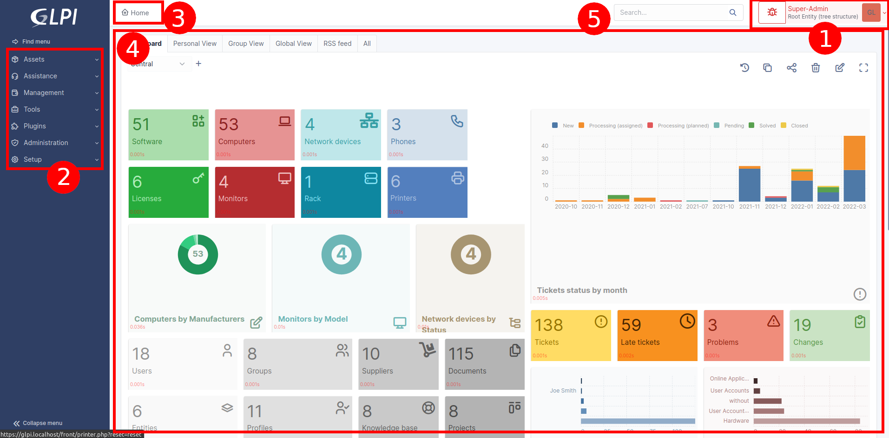

# Understanding the interface

Depending on the user's profile, some menus and content may differ, but
the logic of the interface remains the same.

The i-Vertix ITAM interface is made up of different areas grouping together the
application's functionalities according to their nature.

1.  The user menu allows you to manage your preferences, access help,
    change the current language, change your current profile and entity,
    and disconnect.
2.  The main menu allows you to navigate through the different modules.
3.  The breadcrumb trail allows you to locate the context of use of the
    main work area.
4.  The main working area is the privileged space for interaction with
    the application.
5.  The search box allows you to perform a global search at any time.
