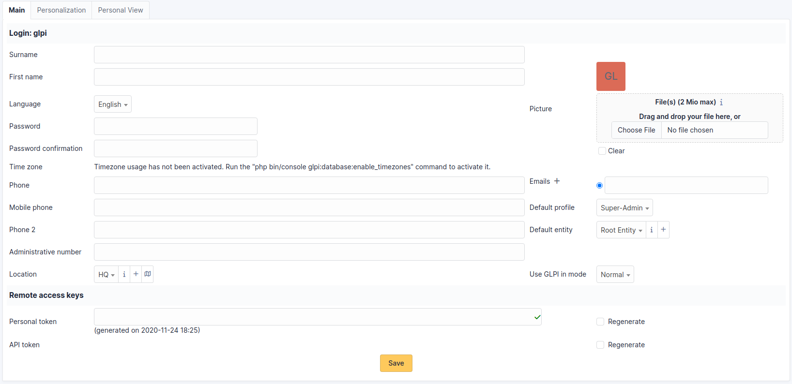

# Manage your Preferences

User preferences are accessible from the *Preferences* tab
of the user form by clicking on your name at the top right of the
interface, from any page.

Each authenticated user has the possibility to modify his preferences if
they have the *Personalize* update right in their profile.

:::info

These options override the default ones set in the general setup. For
more information about the available options refer to the [general setup documentation](../../../modules/configuration/general/default_values.html).

:::

## Main Tab

Here the user can modify the usual personal information:

- Surname
- First name
- Email address
- Phone numbers
- Location
- Language
- ...

:::info

Some fields cannot be modified if they come from an LDAP directory.

:::

A user can add email addresses and select the default address, which
will be used for sending notifications.

They can also specify some default behaviors of the application, such as
the selected profile and entity. They can also turn off notifications
for actions they take.

Depending on the profiles, the experienced user can also choose to exit
the normal application mode. In debug mode, i-Vertix ITAM displays errors, all
variable values, SQL queries, etc. It is useful to activate this mode in
the event of i-Vertix ITAM malfunction. A maximum amount of information can
therefore be communicated to the developers. This mode also allows you
to have additional information on different objects in a specific tab
(notifications, etc.).

## Personalization Tab

This tab allows you to modify the general display preferences applied to
a given user. These parameters take priority over those defined in the
general configuration.

:::info

The Number of results per page value shown here cannot exceed the
maximum value set in the general display options.

:::

Note that the Remote access key section allows you to regenerate the
security key used to access the private flows offered by i-Vertix ITAM. Currently
the ICAL and WEBCAL flows of the planning are protected by this security
key which is integrated into the url.

## Personal View Tab

Lists custom views defined in objects by the user. In particular, it
allows you to delete the personal views defined to return to global
views.
