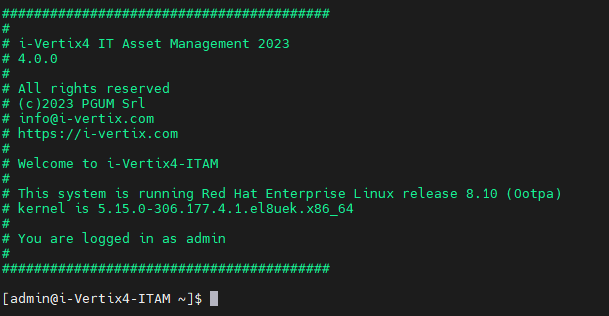
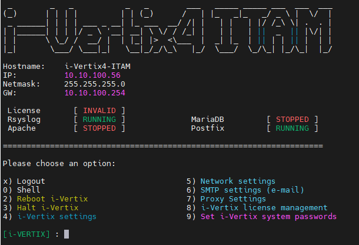
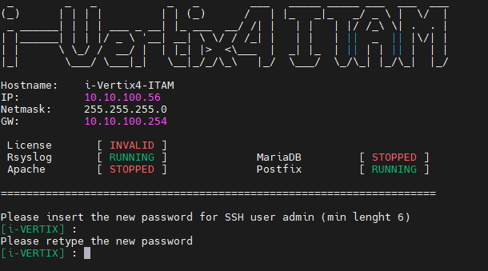
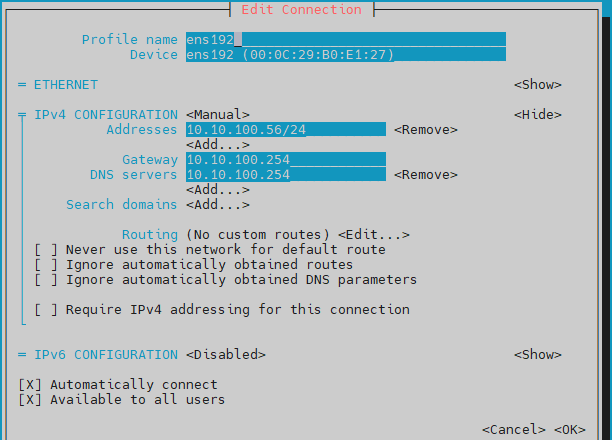

import Tabs from '@theme/Tabs';
import TabItem from '@theme/TabItem';

# Initial Configuration

## First CLI login

After completing the configuration procedure in the chosen hypervisor,
**start** the VM.
You can check the startup process through the **hypervisor console**.
Once the VM is started, the following screen with a login prompt will be displayed:



On an **i-Vertix ITAM** system you will need to log into the i-Vertix console to configure the various settings, using the following credentials:

- User: '**admin**'

- Password: '**changeme**' (please change the password as soon as possible)

<!---
:::danger

If you fail the login process 3 times from ssh, the IP Address will be blocked for 30 minutes (see [fail2ban](../../installation/fail2ban)).

:::
--->

After the authentication, a menu that allows you to configure the vm is displayed.



:::tip

If the menu doesn’t appear automatically at startup, simply type on the console the command

```bash
menu
```

:::

## Password change

In order to **modify the password**:

1. Select option `9) set i-Vertix system passwords`
2. Type the new password **_(min. 6 characters)_** for **SSH user admin** and press Enter
3. Confirm the password and press enter.



## Network setup

:::warning

Before proceeding to modify the network, be sure to operate from the hypervisor console to avoid loss of connectivity.

:::

1. Select option `5) Network settings` from the menu
2. Select Edit Connection
3. Select the proper NIC (for example **ens192**) and then **Modify** followed by your network settings:
4. IPv4 Configuration: **Manual**
5. Addresses: IP address you want to assign to the VM
6. Gateway: your default gateway IP address
7. DNS server: your DNS Server IP Address
8. Search domain: Insert the domain (if necessary)
9. IPv6 Configuration: **Ignore**

Confirm the settings with **OK**



---

Get back to main menu NMTUI (on the left-hand side)

1. To activate the new settings, select **Activate a connection** from the NMTUI menu
2. Select the **NIC** (ens192 by default), then
3. **Deactivate**
4. **Activate**
5. Finally select **Back**

---

Get back to the main NMTUI menu

1. Select **Set a system hostname** to configure the system hostname then select **OK**
2. Select **Quit** to quit the **NMTUI** menu and get back to the **i-Vertix menu**


---

Now the network configuration is complete.
Restart the system if necessary selecting `2) Reboot i-Vertix` in the menu.
Afterwards the system should be accessible via a network connection (for example using **Putty**).

Before moving on, please ensure that the **DNS** is working

```bash
nslookup www.google.com
```

You should see following or a similar result:

```text
nslookup www.google.com
Server:         192.168.25.2
Address:        192.168.25.2#53

Non-authoritative answer:
Name:   www.google.com
Address: 142.251.209.4
Name:   www.google.com
Address: 2a00:1450:4002:402::2004
```

## NTP settings (optional)

Choose option `4) i-Vertix Settings` in the menu.


The options will be displayed:

- `1) NTP time settings`, to configure the NTP servers

- `2) change timezone`, to change the default timezone (Europe/Rome)

## SMTP Configuration (optional)

Select option `6) SMTP settings (e-mail)`


A new menu shows up which displays what the current relay host configurations are:


Select the proper SMTP option among the proposed ones


### Available options

<Tabs>

<TabItem value="Normal" label="normal SMTP" default>


</TabItem>

<TabItem value="Auth" label="SMTP with authentication">


</TabItem>

<TabItem value="Auth and TLS" label="SMTP with authentication and TLS">

**SMTP for Office365 or Amazon AWS SES**


</TabItem>

</Tabs>

### Configuration steps for SMTP

Compile every voice the menu steps indicate for each SMTP option you choose.

Once the proper option has been selected and configured, quit the smtp wizard by typing **`q`**

If you want to test the configuration you've just made, simply type **`T`** in the menu.


:::warning

Provide a real e-mail sender and receiver for the test

:::
