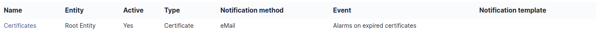

# Groups

Groups tab allows to add, modify, delete, search groups.

Groups can be defined in a hierarchical structure in order to ease
navigation and search.

`Management > Division > Service` or `N3 Support > Network > LAN`

Groups can be used in several way to group users by:

> - **Skills**: for the helpdesk, for example network technicians, or
>   database administrators,
> - **Organizational groups**: for example all the computers of the
>   management or the accounting department but also set of persons to
>   be notified.

The options available to adjust these behaviors are:

> - **Visible in a ticket**: requesting group and/or assignment to this
>   group;
> - **Can be notified**: recipient of notifications;
> - **Can be manager**: only for a
>   [project](../../modules/tools/projects.md);
> - **Can contain**: assets and/or users.

In an item form, 2 notions of groups are available:

> - [Technical group](../../tabs/common_fields/group_in_charge.md) which indicates which group of people is in charge of
>   the asset (equivalent for a group of the technical manager)
> - [Group](../../tabs/common_fields/group.md)
>   which indicates to which group of items it belongs.

:::info

The technical group can allow the automatic assignment of a ticket to
a group of technicians, see the ticket categories in the chapter
[configure dropdowns](../../modules/configuration/dropdowns/assistance.md). Likewise, it can be used in
[Business rules for tickets](../../modules/administration/rules/ticketbusinessrules.md).

:::
:::tip

If all options are set to *No*, the group will not appear in any
selection list; this can be useful for a group that is deleted and kept
for history or for adding empty groups in the hierarchical structure.
:::

A group can have one or more managers, concept which can then be used
for notifications, for example to send an email to the manager(s) of the
group when a ticket is opened, see notification management.

The concepts of manager can be configured in the "Users" tab.

Assigning a user o a group is either static and done using the i-Vertix ITAM
interface, or dynamic when this is automatically extracted from the LDAP
directory.

A group is attached to the entity in which it is created and can then be
visible in sub-entities.

From the list of groups, a group can be imported from a LDAP directory
via the *LDAP directory link* button if external authentication is used
and the "Auth and sync update" authorization is granted in profile.
The assignment of users to groups will be automatic, see
[Profiles](../../modules/administration/profiles). If several directories are configured, the choice between
directories is proposed, otherwise the search form is directly
accessible.

Depending on how you search for groups (see:
[Authenticating users from LDAP directories](../../modules/configuration/authentication/ldap.md)), a **Search filter in groups** and/or a **User search
filter** appear: these allow to refine the list to be imported. If i-Vertix ITAM
is used in multi-entities, it is necessary to select the destination
entity of the group as well as its visibility in the sub-entities.

:::info

Importing groups cannot be filtered by entity. In addition, no group
synchronization function is available. The only way to refresh from a
directory the list of group members is to resynchronize users, see
[Import users from an external source](../../modules/administration/users/usersimport.md).

:::

## Import groups

In `Administration` \> `Groups` \> `LDAP directory link` (at the top of
the page), you have the option to import groups. Depending on the
settings made, users will be managed dynamically.

For more information go to
[setup LDAP](../../modules/configuration/authentication/ldap.md)

## Child groups

This tab allows to add a subgroup to the selected group and lists the
existing subgroups. Each subgroup created will also be visible in
`Administration` \> `Groups`

## Used items

[Tab Used Items](../../tabs/common_fields/group.md) tab lists the elements for which the *Group* field
corresponds to the current group. The search can be extended to
sub-groups as well as to the members of the group (*User* field of the
item).

## Managed items

[Managed Items](../../tabs/common_fields/group_in_charge.md) tab lists the elements for which the *Technical Group* field
corresponds to the current group. The search can be extended to
sub-groups as well as to the members of the group (*Technical manager*
field of the item).

## LDAP directory link

This tab only appears if the "Auth and sync update" authorization is
granted in profile; it gathers the information allowing i-Vertix ITAM to find the
group and its users in the LDAP directory.

## Security

In this tab you can force or not the use of
[2FA](/first-steps/preferences.html#two-factor-authentication-tab) for a
specific group

## Users

This tab allows to add a user to this group by defining whether the
added user is *manager* of the group. It also lists the users of this
group with possible search by this criteria and also in the subgroups of
the current group.

## Notifications

## Created tickets

List all [tickets](../../modules/assistance/problems.md) created or assigned to the group. If a ticket is created by
a group member, but the requester is not explicitly the group, the
tickets will not be visible here. `Show all` allows you to show all
tickets created or assigned, you will then be redirected to `Assistance`
\> `Tickets`

## Problems

List all
[problems](../../modules/assistance/tickets/ticketopening.md) created by the group. `Show all` allows you to show all
problems created by the group, you will then be redirected to
`Assistance` \> `Problems`

## Changes

List all
[changes](../../modules/assistance/tickets/ticketopening.md) created or assigned to the group. `Show all` allows you to
show all changes created by the group, you will then be redirected to
`Assistance` \> `Changes`

## Notes

[Note](../../modules/tabs/notes.md) lets you add
enriched text and attach a document.

## History

The *History* tab is used to show any changes made to an item. The
following information about the changes is available:

- ID of the change.
- Date and time the change was made.
- User who made the change. If this field is not filled, it means that
  the action was done automatically (For example: automatic inventory
  update).
- Field that was changed.
- Description of the change that was made.

The description of the change represents either the difference between
the old and the new value (For example with location field: Change HQ to
Remote Office A), or the explanation of the action which was carried out
(For example: Uninstallation of a software: "Gimp 2.0").

:::info

For dropdowns or objects with a parent/child relationship, the
modification of a child will appear in the history of the parent
element.

:::

## All Information

For an item, all information is displayed on one page from the *All*
tab. This shows all of the tabs of an object's form in one view, one
below the other.
