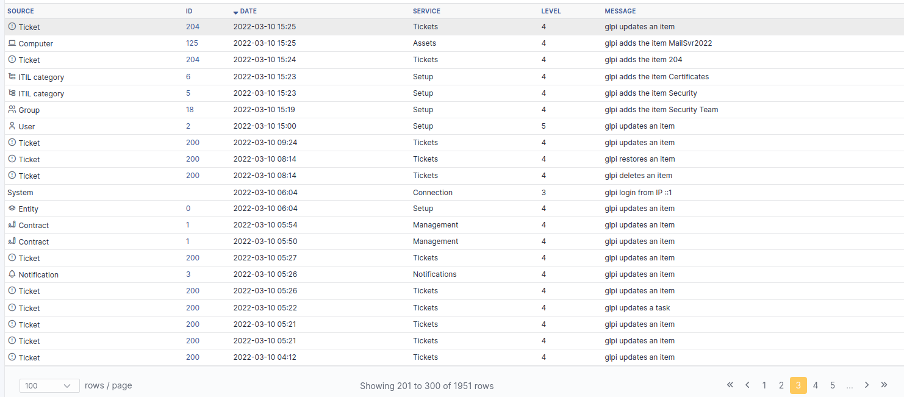

# Logs

This menu allows to display and sort logs.

The logs page displays type of modified information (computer,
reservation, ticket...), the modification date, i-Vertix ITAM service
(inventory, configuration, tickets...) and a message detailing the
event.
:::note

- Log level can be parameterized in field **Log Level** of tab
  **System** of general configuration.
- Log retention period can be parameterized in automatic actions.
:::

<figure class="align-center">

</figure>
