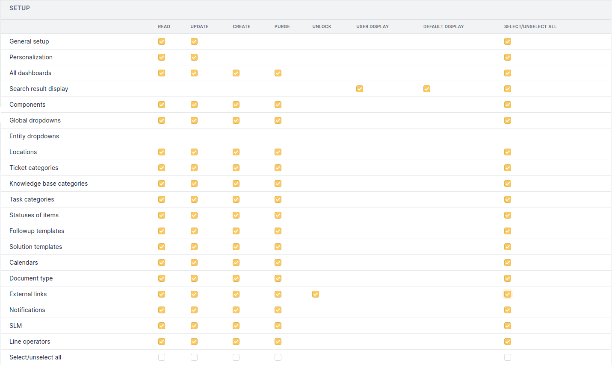

orphan

:   

# Setup permissions

The 7 standard permissions will not be listed (see
[Permissions description](/asset-management/modules/administration/profiles/profiles)).

## All Configuration Permissions

<figure class="align-center">

<figcaption>All Configuration Permissions</figcaption>
</figure>

The **Search result display** permission allows to configure the
displayed columns in the i-Vertix ITAM search engine..

- **User Display**: display a *Personal view* tab allowing display
  customization for the user, the customization being done object by
  object.
- **Default Display**: allows to modify standard display that will apply
  to each user not having a personal view.
