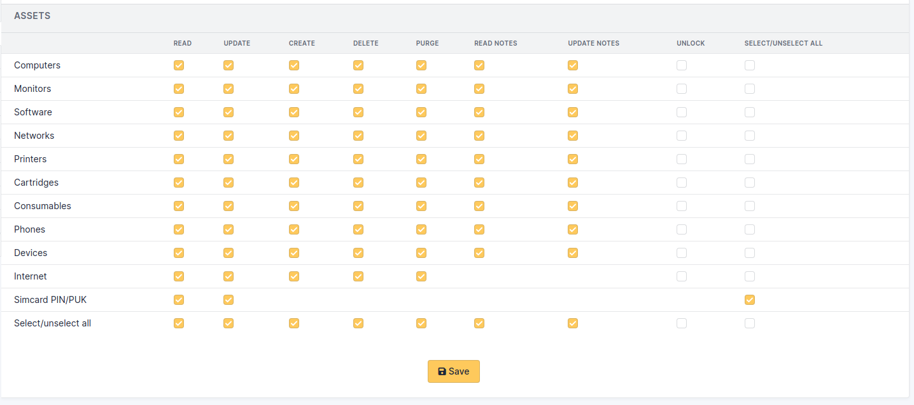
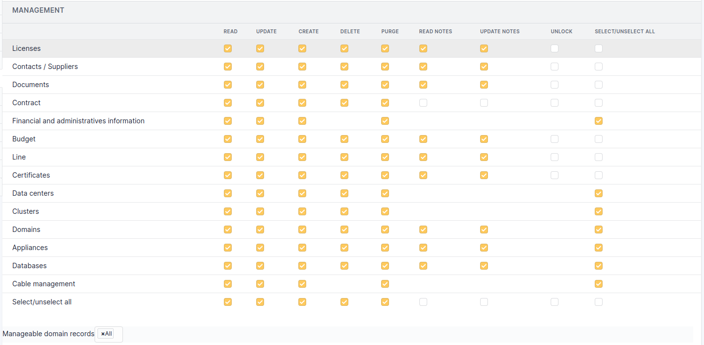

# User profiles

Profile is central in i-Vertix ITAM configuration: profile is the key for users
permissions granting and for securing and isolating data.

A profile is associated with :

- a user
- an entity, in a **recursive** or **dynamic** manner

In order to enable permissions to be passed to child entities, the
profile must be associated recursively.

Different profiles can be associated with the same user, based on
entities and whatever the relation between these entities: this can be
achieved by adding the profile to the user for each entity where user
profile must be different.

By default, 7 profiles are pre-registered in i-Vertix ITAM:

- **Super-Admin**: This profile is granted **all** permissions! ..
  warning :: if the super-admin profile is deleted or if the
  **simplified interface** is associated with this profile, access to
  the i-Vertix ITAM configuration may be permanently lost.
- **Admin**: This profile has administration rights for all i-Vertix ITAM. Some
  restrictions are applied to it at the level of the configuration of
  rules, entities as well as other items which may alter the behavior of
  i-Vertix ITAM.
- **Supervisor**: This profile incorporates the elements of the
  *Technician* profile by adding elements allowing management of a team
  and its organization (allocation of tickets, etc.).
- **Technician**: This profile corresponds to the one used for a
  maintenance technician, having read access to the inventory and to the
  help desk in order to process tickets.
- **Hotliner**: This profile corresponds to the one that could be given
  for a hotline service; it allows to open tickets and follow them but
  not to be in charge of them as a *Technician* can be.
- **Observer**: This profile has read permission to all inventory and
  management data. In terms of assistance, it can open a ticket or be
  assigned one, but cannot administer this section (assign a ticket,
  steal a ticket...).
- **Self-Service**: This profile is the most limited. It is also the
  only one to have a different interface, the
  `simplified interface</first-steps/interfaces>`, as opposed to the **standard interface**. However, it can
  declare a ticket, add a follow-up, consult the FAQ or reserve asset.
  This profile is set as the default profile.

## Permissions description

Once the profile has been created, it will be possible to establish the
permissions on the various functionalities of i-Vertix ITAM. Seven tabs
corresponding to the different menus of i-Vertix ITAM are then available to
manage this set of permissions and are described below.

The different permissions of an object are listed on the line of its
name. To activate an permission, the corresponding box must be checked
and vice versa to delete an permission the box must be unchecked.

:::warning

no permission deduction is done; for example in order to be able to
modify an object, read permission must also be granted.

:::

Permissions after migration: migration takes over old permissions in
full, regardless of the purpose, and activates the corresponding values
​​in the new system. Previous *Write* permission is transformed into
*Read*, *Update*, *Create*, *Delete* and *Purge* for most objects and
must then be refined if needed. For others, the permissions are grouped
by object, for example, FAQ permission are permissions of the Knowledge
Base object.

Some permissions are standards for all objects:

- **Read**: allows to display an object, it is also often this
  permission which displays or not the object in the different menus
- **Update**: allows to display an object data
- **Create**: allows to create a new element of the type of the object
- **Delete**: allows you to place the object in the trash bin. If this
  permission is not present, it means that the object does not have a
  trash bin.
- **Purge**: deletes the object from the trash bin and therefore
  permanently from the database. The permissions can therefore be
  refined between temporary deletion (placing in the trash bin) and
  permanent deletion (purging the trash bin)
- **Read notes**: allows to display the *Notes* tab, if object has one
- **Update notes**: allows to modify the content of a note or to delete
  it

## The different tabs

:::info

the display of profile management depends on the profile of connected
user. It can therefore vary depending on the profile.

:::

### Assets

The 7 standard permissions described above apply to the elements of tab
**Assets**.

The **Internet** permission applies to:

- IP field of a network port
- association or disassociation of a network name to a network port
- Internet part of dropdowns (IP networks, internet domains, WiFi
  networks, network names)

### Assistance

This tab manages permissions on tickets, follow-ups, tasks, validations,
associations, problems and changes. It also manages the visibility of
statistics and schedules as well as the assignment of a template to the
profile.

See
[Tab "Assistance"](/asset-management/modules/administration/profiles/assistancetab)

### Life cycle

This tab manages the permissions on the status life cyle of tickets,
problems and changes.

See
[Tab "Life cycle"](/asset-management/modules/assistance/lifecyclematrix)

### Management

The 7 standard permissions described above apply to the elements of tab
**Management**.

:::warning

The permissions on **Financial and administrative information**
applies also to objects containing financial information; for instance
it is not allowed to purge a computer containing financial information
if profile is not granted with *Purge* permission on financial
information.

:::

### Tools

This tab manages permissions on notes, RSS feeds, public bookmarks,
reports, reservations, knowledge base as well as projects and tasks of a
project.

See
[Tab "Tools"](/asset-management/modules/administration/profiles/toolstab)

### Administration

This tab manages permissions on users, entities and business rules on
tickets.

See
[Tab "Administration"](/asset-management/modules/administration/profiles/administrationtab)

### Configuration

See
[Tab "Configuration"](/asset-management/modules/administration/profiles/configurationtab)

### Users

This tab lists the entities in which this profile is assigned. To see
the corresponding users, click on the concerned entity. *"D"* means
the permissions have been assigned dynamically, *"R"* means the
permissions are recursive from the assignment entity.

### Historical

See [Tab "Historical"](/asset-management/modules/tabs/historical)

### All

See [Tab "All"](/asset-management/modules/tabs/all)
