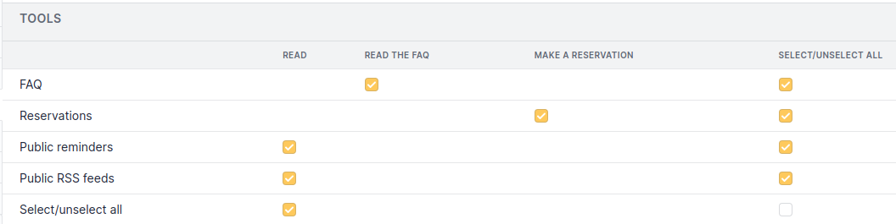
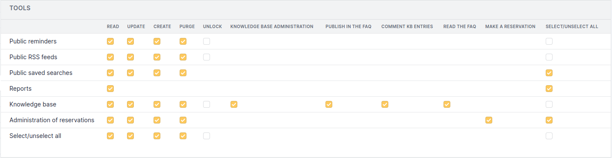
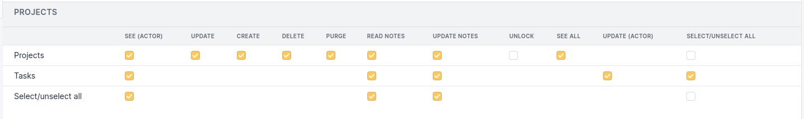

# Tools Permissions

The 7 standard permissions will not be listed (see
[Permissions descriptions](/asset-management/modules/administration/profiles)).

## Simplified Interface

- **Read the FAQ**: see the knowledge base articles which are published
  in the FAQ.
- **Make a Reservation**: reserve an asset.

## Standard Interface

Common fields with the simplified interface will not be detailed.

### Knowledge Base Permissions

- **Knowledge Base Administration**: administer knowledge base access.
- **Publish in the FAQ**: add or remove an article from the FAQ.

### Projects Permissions

- **See (Actor)**: see the projects I have created or for which I am the
  supervisor or member of the supervisor group.
- **See All**: see all the entity's projects.

### Tasks Permissions

- **See (Actor)**: see the tasks I created.
- **Update (Actor)**: modify the tasks that I have created or for which
  I am a member of the team.
