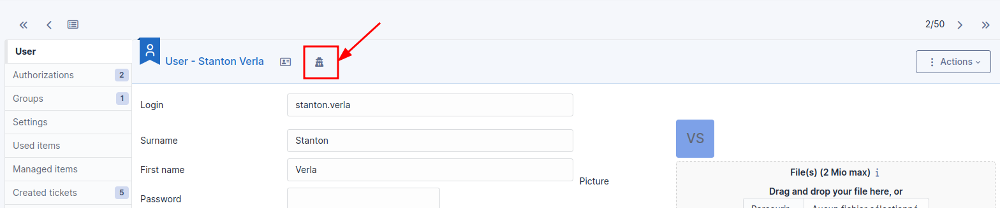
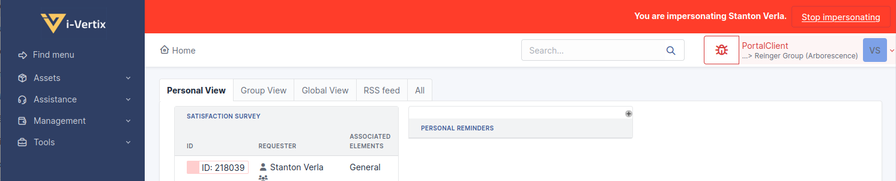

# Users

User management allows to add, modify, delete, search users and to
import and export users list.

- [Usersimport](/asset-management/modules/administration/users/usersimport)

It is possible to deactivate a user if needed. If deactivated, the user
can no longer be selected in drop-down menu for tickets or inventories,
but keeps associated items and tickets. Validity dates can also define
the activity time slot of user: the user account will be considered as
active only after the start date and/or before the end date. Both dates
can be defined independently.

A photo can be added manually or imported automatically from a directory
(see
[Authenticate users with LDAP](../../../modules/configuration/authentication/ldap)).

## Impersonate

For debugging or administrative purposes, it's possible for a
"super-admin" account (or any profile with the configuration rights) to
temporarily take the ownership of another user's account without knowing
its password. An icon is available at the top of the user´s form to
perform this action.

To note:

- A special banner will show permanently as long as the function is
  active and will allow you to exit this mode.
- After the exit, the admin will retrieve its session as it was before
  using the feature.
- The history of actions taken by the administrator will appear with a
  special note: "user (xxx) impersonated by admin (yyy)".

## The different tabs

### Authorizations

This tab allows to manage user authorizations. To add an authorization,
select entity for which authorizations must be given, then select the
profile to attribute. the option [Recursive] allows to
associate the chosen profile to all sub-entities of selected entities.

A summary tab displays already attributed authorizations for the user.

### Groups

This tab lists the groups associated to the user. Table includes group
name, whether the group is dynamic (i.e. linked to a directory service),
whether the user is delegatee or manager for the group (see
[Manage groups](../../../modules/administration/groups)).

If modify user authorization is granted, it is also possible from this
tab to assign a group to the user.

### Settings

This tab allows to edit user's settings (see
[Manage settings](../../../first-steps/preferences)). In order to be able to modify data in this tab, general
configuration modification authorization must be granted.

### Used items

This tab lists the items for which user is defined in field *User* of
the item or for which user is member of the group defined in field
*Group* of the item.

See
Tab "Used items"

### Managed items

This tab lists the items for which user is defined in field *Technician
in Charge* of the item or for which user is member of the group defined
in field *Group in Charge* of the item.

See
Tab "Managed items"

### Reservations

This tab lists passed, current and future reservations of the user. In
order to see this tab, read authorization on reservation management must
be granted.

See
Tab "Reservations"

### Synchronization

This tab is displayed if *Update Authentication and Synchronization*
right is granted. It allows to change authentication method for the user
and to force its synchronization.

### External Links

This tab list external links defined for users.

See [Tab "Links"](../../../modules/tabs/external-links)

### Tickets

The *Tickets* tab is used to create a ticket associated with the current
object. It also lists the tickets already linked to the object.

:::info

A second table lists the tickets attached to the linked elements

:::

:::info

Any deletion or addition of a ticket is recorded in the history.

:::

For users, this tab allows to list tickets created by the user but also
to create directly a ticket (the user will then be defined automatically
as *Requester*).

### Documents

Additional information is stored in the form of external documents which
are files uploaded into i-Vertix ITAM. In the *Documents* tab, documents can be
associated and unlinked with the selected item. The
[management of the documents themselves](../../../modules/management/documents) is dealt with in another chapter.

It is also possible to quickly create a document via this tab by
specifying the desired file and optionally the field in which the new
document is to be placed. The name of the created document will be based
on the name of the added file.

:::info

When you delete a document from this tab via mass actions, you only
remove the link between the object and the document; the document
itself is still present.

:::

### History

The *History* tab is used to show any changes made to an item. The
following information about the changes is available:

- ID of the change.
- Date and time the change was made.
- User who made the change. If this field is not filled, it means that
  the action was done automatically (For example: automatic inventory
  update).
- Field that was changed.
- Description of the change that was made.

The description of the change represents either the difference between
the old and the new value (For example with location field: Change HQ to
Remote Office A), or the explanation of the action which was carried out
(For example: Uninstallation of a software: "Gimp 2.0").

:::info

For dropdowns or objects with a parent/child relationship, the
modification of a child will appear in the history of the parent
element.

:::

### Debugging information

If you have [Debug] mode enabled in your preferences, a
*Debug* tab will appear before the *All* tab. This tab offers
information to help you resolve an issue.

For example, for a computer, you have one or more tables depending on
the affected object (financial information, reservations...) listing
the notifications that will be triggered on this computer with:

- Triggering event
- Recipient(s)
- Notification model used
- Recipient(s) email address

### All Information

For an item, all information is displayed on one page from the *All*
tab. This shows all of the tabs of an object's form in one view, one
below the other.
