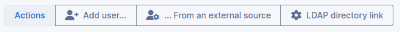

# Import users

From users list, three options are available for adding a user
:

> - **Add user**: Opens a user creation form, similar to the
>   *Add* button; requires profile to be granted user
>   creation authorization
> - **...From an external source**: Import users from external source
> - **LDAP directory link**: Import and synchronize users from LDAP
>   directory

## Import users from external source

This button is available when profile is granted user *External add*
authorization. The identifier of a user being known, i-Vertix ITAM allows to
search user and to import user's authentication information from an
external source. Once user's connection identifier filled, this
identifier is search in available directories (button *Import from
directories*) or in other sources (button *Import from other sources*).
:::warning

- if more that one user is identified by provided identifier, then
  adding is not performed
- when using a mail directory for authentication, no import user list is
  available
:::

User personal information can be imported under some conditions from a
LDAP directory; users imported from a mail server do not get personal
information.

## Import and synchronize users from LDAP directory

This button is available when profile is granted user *External add*
authorization. i-Vertix ITAM allows users advanced search in a LDAP directory.
The interface is restricted to the list of entities for which i-Vertix ITAM
connected user is granted authorization (see
[Administer user profiles](../../../modules/administration/profiles)). Once entity is selected (if i-Vertix ITAM is in multi-entities mode
or if connected user is granted authorization for several entities), a
list of criteria is displayed, based on personal information collected
from directory. The search syntax for fields is similar to the syntax of
i-Vertix ITAM search engine (see [Search](../../../first-steps/search.md)). Search can be limited to users added or modified in the
directory during given time slot by following link *Activate date
filtering*.
:::note

- In order to be able to use simplified interface, either LDAP
  parameters for the entity must have been configured first using
  *Administration \Entity* to assign a directory to the entity or a
  default directory must have been defined.
- This option, coupled with search on criteria, allows to bypass the
  limit of records returned by directory for a LDAP request (see
  `Authenticate users with LDAP directories</modules/configuration/authentication/ldap>`)
- Simplified interface does not require write authorization for users.
  An asset manager or a technician can therefore import users from the
  directory without having access to these imported users after import.
  This option is for example useful for a call center or for a directory
  from which mass users import is not desired.
:::

An **Expert Mode** is also proposed by following link on the right of
table header. This mode is available for users granted with update
authorization either for general configuration or for entities. Unlike
simple interface, results are not filtered by entity: the only available
criteria are directory, based and users search filter.

:::warning

advanced interface is reserved for administrators having knowledge of
both LDAP directory and i-Vertix ITAM users management.

:::

Once imported from a directory, i-Vertix ITAM stores user's LDAP unique
identifier (the *distinguedName* or *DN*) in
addition to connection identifier. This allows to manage updating
connection identifier when DN is left untouched. For example, if
connection identifier is email address, i-Vertix ITAM will be able to update it
without recreating a new user in the case of a change.

If an external authentication source is configured, it becomes possible
to import and synchronize users using this source. For regular
maintenance of the users base, it is recommended to use the i-Vertix ITAM CLI
command *glpi:ldap:synchronize_users*. For daily management,
the manual import mechanism is available (see above).
