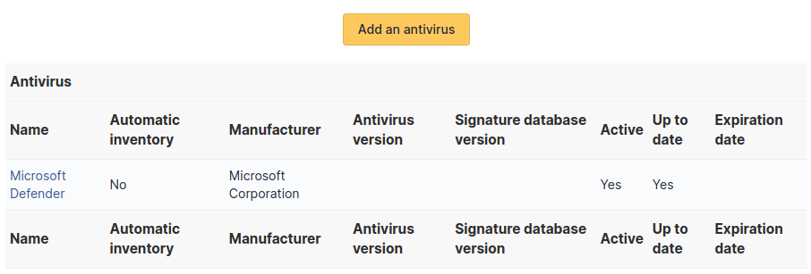

# Antivirus

This tab, named [Antivirus] and visible in a
[Computer] entry, allows to manage the antivirus running on
a computer.

An antivirus is characterized by:

- name
- active/non active
- vendor
- update status
- antivirus version
- signature database version
- expiration date

:::info

Every deletion or addition of an antivirus is recorded in the history
of the computer.

:::

:::info

If using native inventory or third-party inventory tool, the antivirus
information can be automatically imported and updated.

:::
