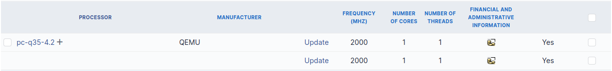
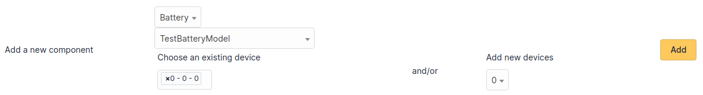
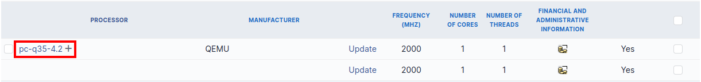
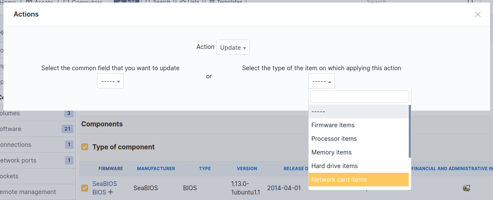
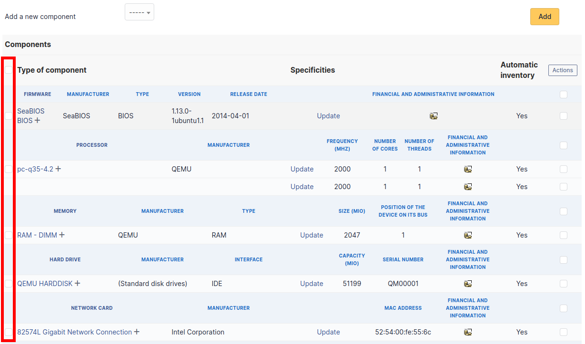
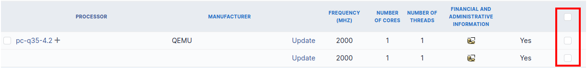
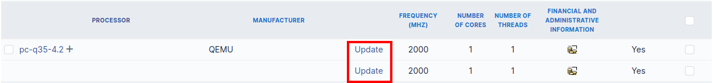

# Components

This tab, named *Components* and visible in a
*Computer* entry, allows to manage the hardware components
of a computer.

:::info

Adding or managing components is located in menu
[Setup > Components](../../../modules/configuration/components.md).

:::

:::info

If several components of the same type are used, they will be grouped
in the view.

:::

It is possible to add a component by first selecting its family in the
drop-down list at the top of the table and then its name and the number
of components to add.

Starting from a computer view, it is possible to modify a component by
clicking on the link under its name.

To act on several components (for example modify an element of the
component, activate accounting information or modify them, delete a
component...), first select the components and then use the
*Actions* button present at the top or the bottom of the
list.

If several types of different components, not having the same
characteristics, are selected for modification, in the actions it will
be asked on which component modification must be applied.

Selection button in left column allows to select all the components at
once.

Selection at right of type column (grayed line) allows to select all
components of the same type (processor, memory, network interface...).

:::info

It is possible to modify the characteristics of a component only for
one computer

From tab *Elements* of the component, click on the link **Update**.

Several tabs are then displayed:

- Tab "Element - Link name of component" : list the
characteristics of this component
- [Tab "Management"](../../../modules/tabs/management.md) : manage administrative and accounting information
- [Tab "Documents"](../../../modules/tabs/documents.md) : attached documents
- [Tab "History"](../../../modules/tabs/historical.md) : history of modifications
- [Tab "Contract"](../../../modules/tabs/contracts.md) : contracts management
- [Tab "Debug"](../../../modules/tabs/debug.md)
: only if you are connected in Debug mode
- [Tab "All"](../../../modules/tabs/all.md) :
all the information are displayed on a single page

:::

:::info

Every deletion or addition of a component is recorded in the history
of the computer.

:::

:::info

If using native inventory or third-party inventory tool, the
components information can be automatically imported and updated.

:::
