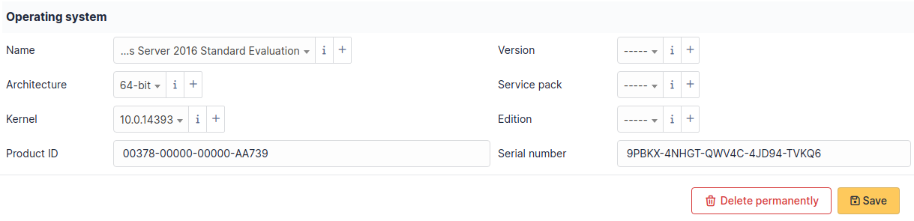
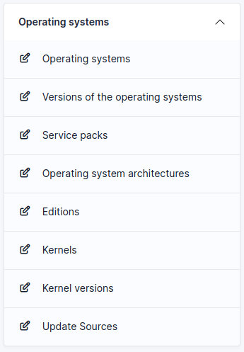

# Operating systems

The information on operating systems for a computer are visible in tabs
*Operating system* for a Computer entry.

An operating system is associated with the following elements:

- Name
- Version
- Architecture
- Service Pack
- Kernel
- Edition
- Product ID
- Serial number

:::info

The creation and management of the titles for operating systems is
located in the menu [Setup \> Drop-downs \> Operating
systems].

:::

:::info

A deletion or addition of an operating system is recorded in the
history of the computer.

:::

:::info

If using native inventory or third-party inventory tool, the operation
system information can be automatically imported and updated.

:::
