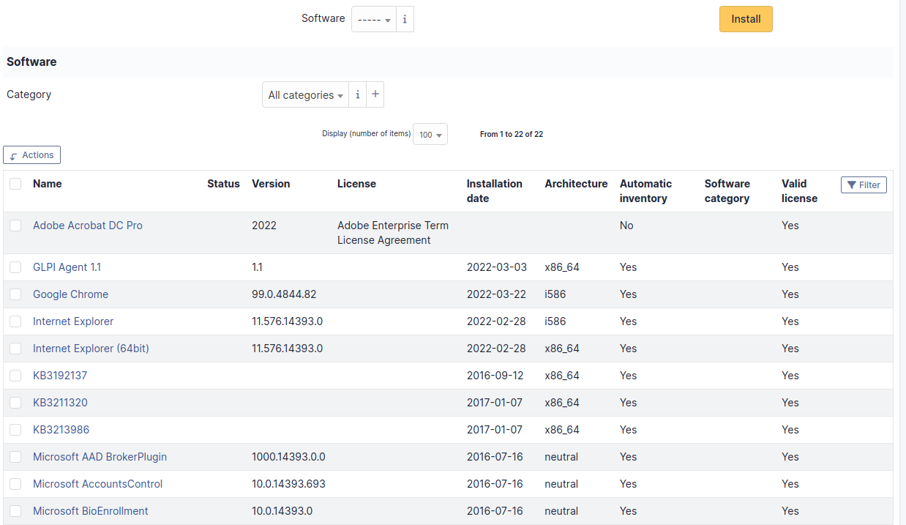

# Software

This tab, named [Softwares] and visible in a
[Computer] entry, allows to manage the software installed on
a computer. Those software are sorted by their category and are
characterized by name, version and version status.

To install a software, first select its name in the drop-down list, then
its version.

It is possible to associate a license to a software on a computer.

To associate a license, first select the software in the drop-down list,
then the wanted license.

If the license is associated with a software that is already installed
on the computer, it will be presented in the list of software.

Otherwise it will be displayed in a separate table.

:::note

- the drop-down list enumerates the software that are available in the
  entity
- licenses management can be found in [Assets \Softwares].
  See [Manage software](/asset-management/modules/assets/softwares)
:::

:::info

It is possible via mass actions to install on a computer a software
selected from its license.

:::

:::info

Every deletion or addition of a software or a license is recorded in
the history of the computer.

:::

:::info

If using native inventory or third-party inventory tool, the software
information can be automatically imported and updated.

:::
