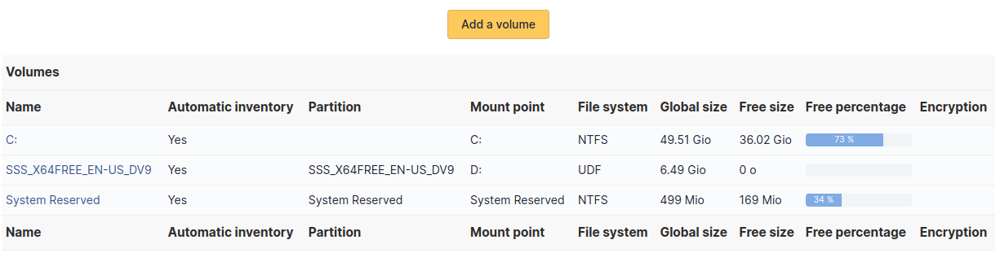
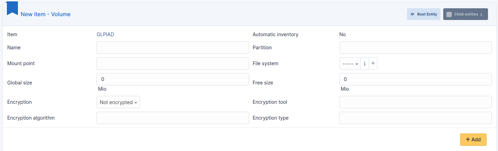
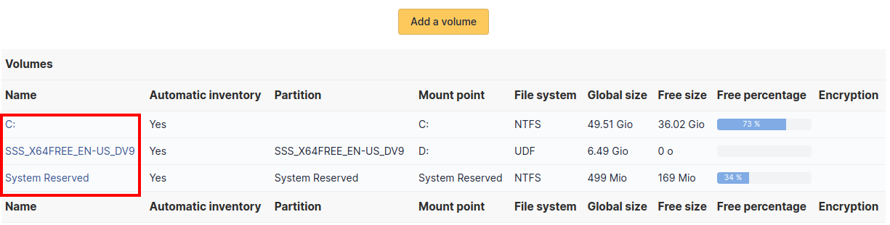

# Volumes

This tab, named *Volumes* and visible in a
*Computer* entry, allows to manage the volumes attached to a
computer.

A volume attached to a computer is characterized by:

- name
- physical partition
- mount point
- file system
- total size
- available size
- ciphering algorithm and type

It is possible from a *Computer* entry to add a volume by
clicking on button `Add a volume`.

It is possible from a *Computer* entry to modify an existing
volume by clicking on the link under its name.

:::info

Every deletion or addition of a volume is recorded in the history of
the computer.

:::

:::info

If using native inventory or third-party inventory tool, the volumes
information can be automatically imported and updated.

:::
