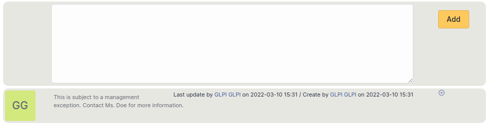

# Manage problems

A problem is the cause of potential incidents and, once identified, can
be managed in i-Vertix ITAM.

Creating a problem object can be done either from the ticket form, in
tab *Problem*, or directly from menu *Assistance \> Problems*.

The problem creation form is very similar to the ticket creation form
and shares with it many concepts: *Requester*,
*Watcher*, *Assigned to*, *Status*,
*Urgency*, *Impact*, *Priority*,
*Category*. For more information, see
[Manage tickets](../../modules/assistance/tickets/ticketmanagement.md).

Problems use their own notifications, see
[configuration of email follow-ups](../../modules/configuration/notifications/email_notifications).

Statistics similar to tickets are available for problems, see
[Display statistics](../../modules/assistance/statistics.md).

## The different tabs

### Changes

This tab allows to display changes associated with the problem and add
new changes. See
Solutions

### Analysis

This tab contains problem analysis and describes impacts, causes and
symptoms.

### Solutions

This tab allows to describe the resolution of the problem. See
Solutions

### Statistics

Statistics similar to tickets are available for problems. See
Statistics

### Tasks

A task is an action linked with a problem, usually a technical
intervention. See
Tasks

### Costs

This tab defines the costs applicable to this problem. See
Costs

### Elements

This tab allows to attach an item to the problem by choosing the type
and the selected item. See
Items

### Tickets

The *Tickets* tab is used to create a ticket associated with the current
object. It also lists the tickets already linked to the object.

:::info

A second table lists the tickets attached to the linked elements

:::

:::info

Any deletion or addition of a ticket is recorded in the history.

:::

### Documents

Additional information is stored in the form of external documents which
are files uploaded into i-Vertix ITAM. In the *Documents* tab, documents can be
associated and unlinked with the selected item. The
[management of the documents themselves](../../modules/management/documents) is dealt with in another chapter.

It is also possible to quickly create a document via this tab by
specifying the desired file and optionally the field in which the new
document is to be placed. The name of the created document will be based
on the name of the added file.

:::info

When you delete a document from this tab via mass actions, you only
remove the link between the object and the document; the document
itself is still present.

:::

### Notes

The *Notes* tab provides a free text field for storing additional
information. Notes are displayed in the order of their creation.

### History

The *History* tab is used to show any changes made to an item. The
following information about the changes is available:

- ID of the change.
- Date and time the change was made.
- User who made the change. If this field is not filled, it means that
  the action was done automatically (For example: automatic inventory
  update).
- Field that was changed.
- Description of the change that was made.

The description of the change represents either the difference between
the old and the new value (For example with location field: Change HQ to
Remote Office A), or the explanation of the action which was carried out
(For example: Uninstallation of a software: "Gimp 2.0").

:::info

For dropdowns or objects with a parent/child relationship, the
modification of a child will appear in the history of the parent
element.

:::

### All Information

For an item, all information is displayed on one page from the *All*
tab. This shows all of the tabs of an object's form in one view, one
below the other.
