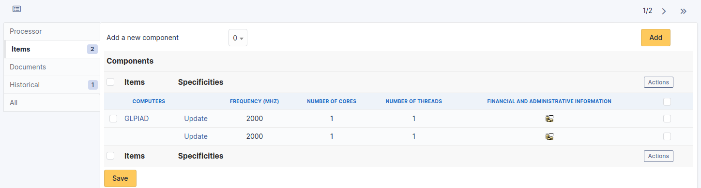

# Components

The hardware components that can be added to computers are configurable.

A hardware component is defined by a type, a name, a manufacturer, a
comment, and several fields specific to the type of component. For
example, for a system board, you can enter the chipset.

:::info

It is possible to fill in other component types inside the *Other
Components* type. However, it is not possible to add other types than
those listed here.

:::

Once a component type has been selected (*Motherboard*,
*Processor*...), you are redirected to the list of components already
created.

## The different tabs

### Main

Information that defines a hardware component (different information
depending on the type of component).

Example for a Processor:

### Items

The elements tab allows to visualize the computers linked to the
component.

:::note

- **It is possible to modify the characteristics of a component only for
  the linked item**

  From the *Elements* tab of the component, click on the **Update**
  link.

  Several tabs are then proposed:

  - \`Element - Component name link tab\`: lists the characteristics of
    this component
  - [Management tab](../tabs/management):
    manage financial and administrative information
  - [Documents tab](../tabs/documents)
  - [Historical tab](../tabs/historical)
  - [Debug tab](../tabs/debug): only
    shown if you have debug mode enabled
  - [All tab](../tabs/all): for an item,
    all information is displayed on a page
:::

### Documents

Additional information is stored in the form of external documents which
are files uploaded into i-Vertix ITAM. In the *Documents* tab, documents can be
associated and unlinked with the selected item. The
[management of the documents themselves](/asset-management/modules/management/documents) is dealt with in another chapter.

It is also possible to quickly create a document via this tab by
specifying the desired file and optionally the field in which the new
document is to be placed. The name of the created document will be based
on the name of the added file.

:::info

When you delete a document from this tab via mass actions, you only
remove the link between the object and the document; the document
itself is still present.

:::

### History

The *History* tab is used to show any changes made to an item. The
following information about the changes is available:

- ID of the change.
- Date and time the change was made.
- User who made the change. If this field is not filled, it means that
  the action was done automatically (For example: automatic inventory
  update).
- Field that was changed.
- Description of the change that was made.

The description of the change represents either the difference between
the old and the new value (For example with location field: Change HQ to
Remote Office A), or the explanation of the action which was carried out
(For example: Uninstallation of a software: "Gimp 2.0").

:::info

For dropdowns or objects with a parent/child relationship, the
modification of a child will appear in the history of the parent
element.

:::

### All Information

For an item, all information is displayed on one page from the *All*
tab. This shows all of the tabs of an object's form in one view, one
below the other.
