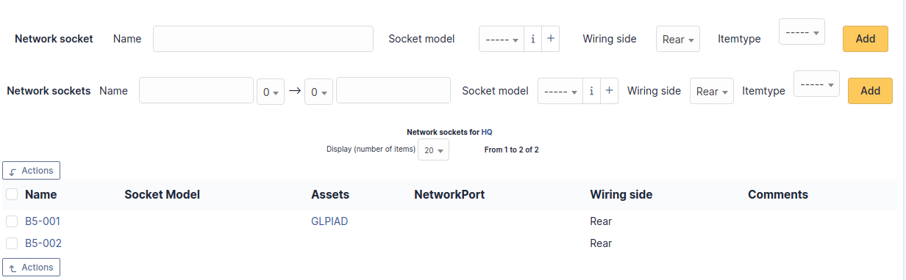

# Common

## Locations

The list of locations is organized into a tree structure. Each location
can have sub-locations (Location 1 \> Sub-location 1 \> Sub-sub-location
1). It can be delegated by entity.

In the record of a location, there is some information about it
including:

- The parent location
- Building number
- Room number
- GPS coordinates (longitude, latitude, altitude)
- Street address

If you allow i-Vertix ITAM to use your location, the map displayed when creating
a new location will automatically show your approximate location to help
make assigning GPS coordinates easier.

### Locations

Displays a list of locations that are children of the current location
and gives an option to add new child locations.

### Items

Displays a list of items that have this location assigned to them. You
are able to filter this list by a specific item type (Computers,
Monitors, etc).

### History

The *History* tab is used to show any changes made to an item. The
following information about the changes is available:

- ID of the change.
- Date and time the change was made.
- User who made the change. If this field is not filled, it means that
  the action was done automatically (For example: automatic inventory
  update).
- Field that was changed.
- Description of the change that was made.

The description of the change represents either the difference between
the old and the new value (For example with location field: Change HQ to
Remote Office A), or the explanation of the action which was carried out
(For example: Uninstallation of a software: "Gimp 2.0").

:::info

For dropdowns or objects with a parent/child relationship, the
modification of a child will appear in the history of the parent
element.

:::

### Translation

This tab is reserved for names and only appears if the translation of
dropdown names has been enabled in the general configuration.

This tab lists all current translations of the dropdown name and allows
you to add new ones.

### Sockets

Lists the network sockets assigned to this location and allows to add a
new one. In this case, when selecting a socket on a network port of a
device, only the available network sockets of the device location (and
child locations) are shown. The addition can be single via the top part
or multiple via the bottom part. For adding multiple sockets, you can
prefix the socket number as shown in the screenshot. Another example:
considering the prefix *bru*, *9* and
*11* the socket numbers and *srv* the suffix;
the network sockets created will be named: *bru09srv*,
*bru10srv* and *bru11srv*.

### All Information

For an item, all information is displayed on one page from the *All*
tab. This shows all of the tabs of an object's form in one view, one
below the other.

## Status of items

The list of statuses is organized into a tree structure. Each status can
have sub-locations (Status 1 \> Sub-status 1 \> Sub-sub-status 1). It
can be delegated by entity.

### Statuses of items

Displays a list of statuses that are children of the current status and
gives an option to add new child statuses.

### Translation

This tab is reserved for names and only appears if the translation of
dropdown names has been enabled in the general configuration.

This tab lists all current translations of the dropdown name and allows
you to add new ones.

### All Information

For an item, all information is displayed on one page from the *All*
tab. This shows all of the tabs of an object's form in one view, one
below the other.

## Manufacturers

This list is a flat list of values valid for all entities.

This dropdown type cannot be translated.

## Blacklists

This list is a flat list of values valid for all entities.

It includes the value you want to blacklist as well as what type to
blacklist (IP, MAC, serial number, UUID or email). Blacklists are used
for automatic imports via an inventory agent or by the receiver.

This dropdown type cannot be translated.

### History

The *History* tab is used to show any changes made to an item. The
following information about the changes is available:

- ID of the change.
- Date and time the change was made.
- User who made the change. If this field is not filled, it means that
  the action was done automatically (For example: automatic inventory
  update).
- Field that was changed.
- Description of the change that was made.

The description of the change represents either the difference between
the old and the new value (For example with location field: Change HQ to
Remote Office A), or the explanation of the action which was carried out
(For example: Uninstallation of a software: "Gimp 2.0").

:::info

For dropdowns or objects with a parent/child relationship, the
modification of a child will appear in the history of the parent
element.

:::

### All Information

For an item, all information is displayed on one page from the *All*
tab. This shows all of the tabs of an object's form in one view, one
below the other.

## Blacklisted email content

This list is a flat list of values valid for all entities.

It allows the receiver to not import an email containing the defined
text. This can allow, among other things, to fight against spam in the
case of the authorization of ticket creation for anonymous emails.

This dropdown type cannot be translated.
