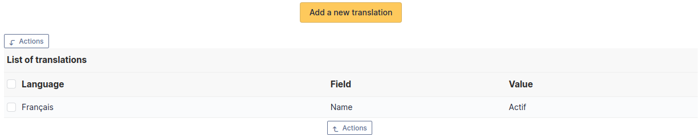

# Translation

This tab is reserved for names and only appears if the translation of
dropdown names has been enabled in the general configuration.

This tab lists all current translations of the dropdown name and allows
you to add new ones.
