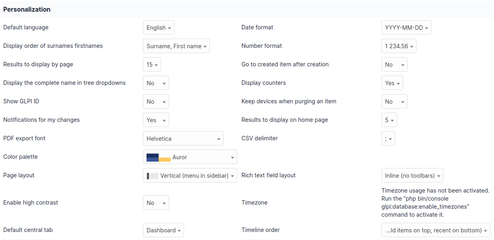

# Default values

This tabs allows to configure the display preferences that are used by
default. They can be overridden for each user (see [manage preferences](../../../first-steps/preferences.html)).

## Personalization

- **Default language** The language to use in the i-Vertix ITAM interface
- **Results to display by page** The number of results displayed in the
  search results list. If a user sets this higher than what is specified
  in the general setup, then they will be limited to the general
  setup's value.
- **Display the complete name in tree dropdowns** Display the full name
  of child items in a tree dropdown
- **Show i-Vertix ITAM ID** Adds the i-Vertix ITAM ID after its name on the item's edit
  form
- **Notifications for my changes** Receive notifications for the actions
  that the logged in user has done. This does not apply to the creation
  of a ticket for which the notification is systematically sent (proof
  of creation).
- **PDF export font** The font used when generating PDF exports
- **Go to created item after creation** If enabled, the user would be
  redirected to the edit from of the item after it gets created.
  Otherwise, they would remain on the new item form to be able to add
  more items.
- **Date format** Display format for dates
- **Number format** Display format for numbers
- **Display order of surnames/firstnames** Display order for a user's
  first and last name
- **Display counters** If enabled, the number of elements will be shown
  next to some tab names such as the [Items] tab in a
  Ticket.
- **CSV delimiter** Character to delimit fields in a CSV export
- **Results to display on home page** The number of items to display in
  the Ticket, Change, and Problem tables on the home page. If this
  parameter is set to 0, only the table titles will be displayed but you
  can access their respective contents by clicking on the name of the
  table.
- **Keep devices when purging an item** : If enabled, the components
  linked to an item that is being deleted can be preserved. Otherwise,
  they will be deleted along with the item.

## Assistance

- **Private followups by default** If enabled, followups are
  pre-selected to be private.
- **Private tasks by default** If enabled, tasks are pre-selected to be
  private.
- **Tasks state by default** Pre-selected state for tasks
- **Pre-select me as a technician when creating a ticket** The logged in
  user will automatically be assigned to the ticket while creating it.
  This only applies to users who can be assigned to tickets.
- **Priority colors** Define the colors used in the interface to
  differentiate the different priority levels.
- **Show new tickets on the home page** If the logged in user has the
  right to see all tickets, a table listing all tickets with the "New"
  will be displayed in the *Overview* tab of the home page.
- **Request sources by default** Pre-selected request source for new
  tickets
- **Automatically refresh data (tickets list, project kanban) in
  minutes** : Automatically refresh the information in the tickets list
  and Kanban. If set to 0, the automatic refresh is disabled.

## Due date progression

Allows to define the colors that will be applied in the progress bar of
an object. These different states depend on the thresholds set in
percent, hours or days.

## Dashboards

Configure the default dashboards for the home page (central), assistance
module, assets module, and above the tickets search results list.
