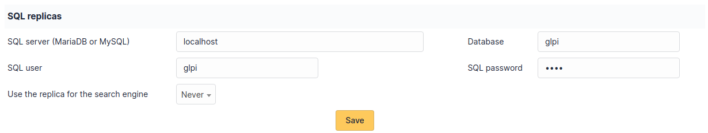

# SQL replicas

i-Vertix ITAM can be configured to use replica databases in some cases to improve
performance.

This tab is only visible if the option has been enabled in the [system tab](system.html).

To activate the replica management, you just have to fill in the
connection parameters. It is advisable to use a login that has only read
privileges on the database.

You can use several replicates by separating them with a **blank
space**. As the result in the config_db_slave.php file, the dbhost
parameter will be an array.

A specific port can also be added.

:::warning

If you use multiple replicas, the settings will apply to them all.

:::

The SQL replicas will be used in at least the following cases:

- The main server cannot be reached. In this case, i-Vertix ITAM will switch to
  read-only mode.
- Running reports to reduce the load on the main server.

It is also possible to use replicas for the search engine depending on
the option chosen.

- **Never**
- **If synced (all changes)** i-Vertix ITAM will check the synchronization and
  use the replica if all changes have been replicated.
- **If synced (current user changes)** i-Vertix ITAM will check the
  synchronization and use the replica if all the changes for the current
  user have been replicated. If using a read-only account, the replica
  will always be used.
- **If synced or read-only account** i-Vertix ITAM will check the synchronization
  and use the replica if all changes have been replicated. If using a
  read-only account, the replica will always be used.
- **Always**

:::warning

When always using the replica, it is possible that the results will be
out of date. A different option should be considered before this one.

:::

:::info

The replication configuration of your database is not set by i-Vertix ITAM. You
still need to configure that with the appropriate tools for your
database management system.

:::
