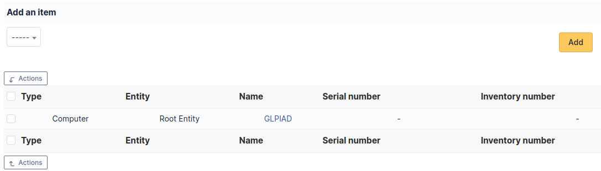
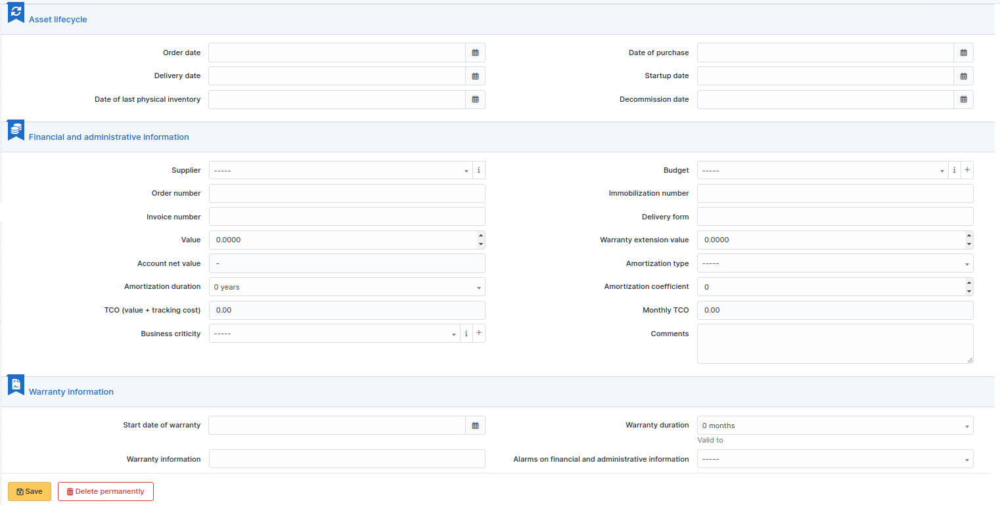
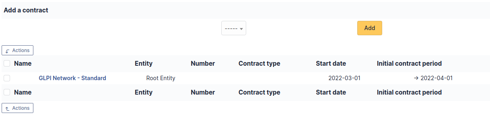

# Certificates

Certificates management in i-Vertix ITAM allows to:

- Create an inventory of all organization certificates;
- Follow installation of certificates on assets;
- Include certificates in i-Vertix ITAM financial management;
- Anticipate and follow certificates renewal.

:::info

It is possible to use
[templates to generate this object](../overview/templates).

:::

## Description of specific fields

- **Manufacturer (Root CA)**: This drop-down list allows you to select
  the certificate manufacturer;
- **Self-signed**: Tells whether certificate is self-signed;
- **DNS name**: The prefix of the domain name associated with the
  certificate (for example, if domain name is
  [server.mycompany.com], DNS name is [server]);
- **DNS suffix**: The suffix of the domain name associated with the
  certificate (for example, if domain name is
  [server.mycompany.com], DNS suffix is
  [mycompany.com]);
- **Expiration date**: Expiration date of the certificate, useful to
  configure alerts and anticipate renewal;
- **Command used**: Can store the system command that generated the
  certificate;
- **Certificate Request (CSR)**: Can store the system command that
  generated the CSR file;
- **Certificate**: Can store the data contained in the CRT file (PEM).

## The different tabs

### Associated elements

The *Items* tab is used to show or add linked assets.

### Management

Management of financial and administrative information, this information
is visible in the 'Management' tab on the computer's form.

By default this management is disabled. It is possible to activate the
financial information on any type of object in the inventory by using
the link in the *Management* tab of the material detail.

:::info

It is possible to activate the administrative and financial
information from the massive actions on a set of elements (computer,
monitor, ...)

:::

:::info

It is possible to activate the administrative and financial
information as soon as an element is created. See "Enable default
administrative and financial information" option in Setup \> General
\> Asset tab.

:::

Financial information consists of the following items:

#### Lifecycle

- Order date
- Date of purchase
- Delivery date
- Date of implementation
- Date of last physical inventory
- Date of reform

#### Financial and administrative information

- Supplier: Third party who sold the equipment. See
  [Managing suppliers](/asset-management/modules/management/suppliers). Suppliers are managed from the menu **Management \>
  Suppliers**.
- Order number : number of the order of the equipment.
- Asset number.
- Invoice number: equipment invoice number.
- Delivery note: delivery note for the equipment.
- Value: cost of the equipment.
- Warranty extension value: cost of the warranty extension, but
  preferably use contracts.
- Account net value: this is the automatic calculation of the gross
  value of a piece of equipment minus the amount of depreciation.
- Type of depreciation: choice of the type of depreciation between
  linear and declining balance.
- Depreciation period: depreciation period expressed in years.
- Depreciation coefficient: coefficient applied to a straight-line
  depreciation type in order to obtain the values of the declining
  balance type. It is therefore only used if the type of depreciation is
  declining balance.
- TCO (value+amount of interventions): the total cost of ownership which
  includes all the constituent elements of an invoiced product.
- Budget: the budget on which this equipment was purchased See
  [Managing the budget](../management/budgets).
- Order date: date on which the material was ordered.
- Purchase date: date on which the equipment was purchased.
- Delivery date: date on which the equipment was delivered.
- Startup date: date on which the equipment was put into service.
- Date of last physical inventory: date of the last physical inventory
  of the equipment.
- Comments.
- Monthly TCO: TCO divided by the number of months between today's date
  and the date of purchase of the equipment.

#### Warranty information

- Warranty start date: date on which the warranty of the equipment
  starts

- Warranty information: text qualifying the warranty

- Warranty period: duration of the warranty expressed in months

  :   If a warranty start date and a warranty period are set, the
      information "Expires on" will appear with a date in red if it is
      earlier than the current date

All the dates defined can be managed automatically according to changes
in the status of the equipment. Some dates can also be copied from
another date. All this configuration is done by
\[entity\](administration_entity_delegation.dita).

#### Tips

i-Vertix ITAM allows you to configure a notification on the expiry of the
hardware warranty. This is configurable by entity in
[notification management](configure_notifications) to define the models and recipients used and in
[the administration of entities](/asset-management/modules/administration/entities) to enable or disable this feature, define the default values
and anticipate the sending of the notification if necessary.

i-Vertix ITAM can perform a simple net book value calculation based on
straight-line or declining balance depreciation. To do so, a certain
amount of information (value, date, etc.) must be entered. The user must
also enter the date of the financial year the general configuration.

The display of financial information for each type of equipment depends
on the profile of the user logged in.

### Associated Contracts

The *Contracts* tab is used to show or add linked contracts.

For each associated contract, the name, number, contract type, supplier,
start date and initial duration of the contract are listed. In the last
field, the end date of the contract is also shown with a red display if
the date is earlier than the current date.

Refer to
[contract management](/asset-management/modules/management/contract) for more information.

### Documents

Additional information is stored in the form of external documents which
are files uploaded into i-Vertix ITAM. In the *Documents* tab, documents can be
associated and unlinked with the selected item. The
[management of the documents themselves](/asset-management/modules/management/documents) is dealt with in another chapter.

It is also possible to quickly create a document via this tab by
specifying the desired file and optionally the field in which the new
document is to be placed. The name of the created document will be based
on the name of the added file.

:::info

When you delete a document from this tab via mass actions, you only
remove the link between the object and the document; the document
itself is still present.

:::

### Knowledge base

The *Knowledge base* tab is used to show or add linked knowledge base
articles.

### Tickets

The *Tickets* tab is used to create a ticket associated with the current
object. It also lists the tickets already linked to the object.

:::info

A second table lists the tickets attached to the linked elements

:::

:::info

Any deletion or addition of a ticket is recorded in the history.

:::

### Problems

The *Problems* tab is used to create a problem associated with the
current object. It also lists the changes already linked to the object.

This summary table includes for each object:

- Status
- Date (opening or expiry date, resolution or closing date depending on
  the status of the problem)
- Priority
- Requestor(s) and assigned technician(s)
- Associated elements
- Category
- Name
- Column indicating the number of scheduled tasks

:::info

A second table lists the problems attached to the related elements

:::

:::info

Any deletion or addition of a problem is recorded in the history.

:::

### Changes

The *Changes* tab is used to create a change associated with the current
object. It also lists the changes already linked to the object.

This summary table includes the following fields for each object:

- Status
- Date (opening or expiry date, resolution or closing date depending on
  the status of the change)
- Priority
- Requestor(s) and assigned technician(s)
- Associated elements
- Category
- Name
- Number of scheduled tasks

:::info

A second table lists the changes attached to the related elements

:::

:::info

Any deletion or addition of a change is recorded in the history.

:::

### Associated External Links

The *External links* tab is used to show associated external links.

For some items, external links are managed from the menu **Setup \>
External links**.

These links can use object fields such as IP, name, etc. See
[Configure protocol external links](/asset-management/modules/configuration/external_links).

Examples:

- A web link: [http://192.168.0.1](http://192.168.0.1) (IP retrieved from the network port
  of the hardware) ;
- A RDP link for remote access: glpi://MSTSC.EXE,pc001 (name "pc001"
  retrieved from the hardware).

### Notes

The *Notes* tab provides a free text field for storing additional
information. Notes are displayed in the order of their creation.

### History

The *History* tab is used to show any changes made to an item. The
following information about the changes is available:

- ID of the change.
- Date and time the change was made.
- User who made the change. If this field is not filled, it means that
  the action was done automatically (For example: automatic inventory
  update).
- Field that was changed.
- Description of the change that was made.

The description of the change represents either the difference between
the old and the new value (For example with location field: Change HQ to
Remote Office A), or the explanation of the action which was carried out
(For example: Uninstallation of a software: "Gimp 2.0").

:::info

For dropdowns or objects with a parent/child relationship, the
modification of a child will appear in the history of the parent
element.

:::

### All Information

For an item, all information is displayed on one page from the *All*
tab. This shows all of the tabs of an object's form in one view, one
below the other.
