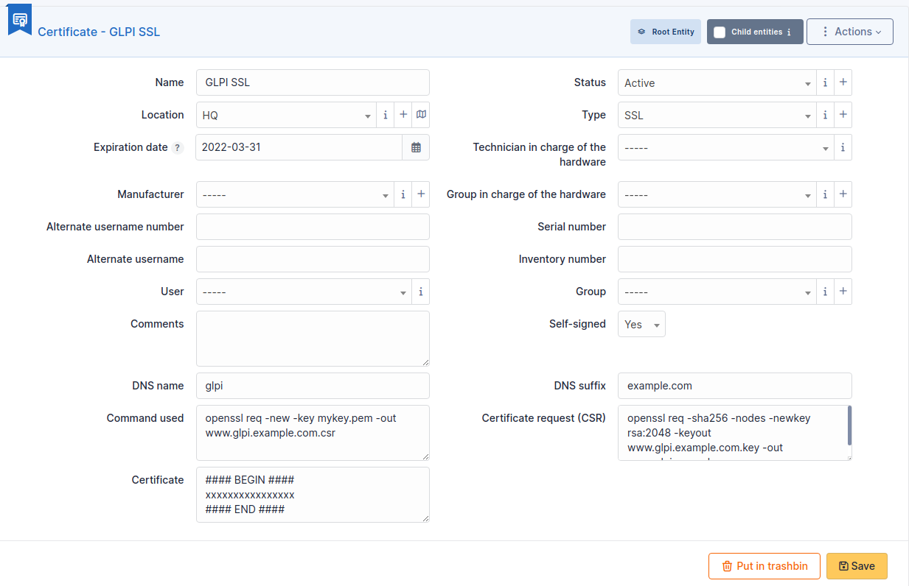

# Certificates

Certificates management in i-Vertix ITAM allows to:

- Create an inventory of all organization certificates;
- Follow installation of certificates on assets;
- Include certificates in i-Vertix ITAM financial management;
- Anticipate and follow certificates renewal.

:::info

It is possible to use
[templates to generate this object](../../modules/overview/templates).

:::

## List of basic fields

- Name
- [Status](../../tabs/common_fields/status.md)
- [Location](../../tabs/common_fields/location.md)
- [Technician in charge](../../tabs/common_fields/technician_in_charge.md)
- [Group in charge](../../tabs/common_fields/group_in_charge.md)
- [Alternate usernmame number](../../tabs/common_fields/alternate_username.md)
- [Serial number](../../tabs/common_fields/serial_number.md)
- [Alternate usernmame](../../tabs/common_fields/alternate_user.md)
- [Inventory number](../../tabs/common_fields/inventory_number.md)
- [User](../../tabs/common_fields/user.md)
- [Group](../../tabs/common_fields/group.md)
- [Manufacturer](../../tabs/common_fields/manufacturer.md)
- [Inventory number](../../tabs/common_fields/inventory_number.md)
- [Comments](../../tabs/common_fields/comments.md)

## Description of specific fields

- **Manufacturer (Root CA)**: This drop-down list allows you to select
  the certificate manufacturer;
- **Certificate type** :
- **Self-signed**: Tells whether certificate is self-signed;
- **DNS name**: The prefix of the domain name associated with the
  certificate (for example, if domain name is
  *server.mycompany.com*, DNS name is *server*);
- **DNS suffix**: The suffix of the domain name associated with the
  certificate (for example, if domain name is
  *server.mycompany.com*, DNS suffix is
  *mycompany.com*);
- **Expiration date**: Expiration date of the certificate, useful to
  configure alerts and anticipate renewal;
- **Command used**: Can store the system command that generated the
  certificate;
- **Certificate Request (CSR)**: Can store the system command that
  generated the CSR file;
- **Certificate**: Can store the data contained in the CRT file (PEM).

## The different tabs

### Items

List of all other linked i-Vertix ITAM [Items](../../tabs/item.md). You can manually add an item by selecting it from the
drop-down list.

### Domains

[Domains](../../modules/management/domains.md)
represents an Internet domain, with its name, expiration date... This
object can itself be linked to other objects in i-Vertix ITAM support (tickets,
problems, changes).

### Management

[Management](../../modules/tabs/management.md) of
financial and administrative information, this information is visible in
the 'Management' tab on the object form.

### Contracts

i-Vertix ITAM supports
[contracts management](../../modules/management/contract.md), in order to manage contract types such as loan,
maintenance, support...

Contracts management allows to:

- make an inventory of all contracts related to the organization assets
- integrate contracts in i-Vertix ITAM financial management
- anticipate and follow contract renewal.

### Documents

The [document](../../modules/management/documents.md) tab lets you link different types of file to a material
(PDF, txt, png, etc.) You can attach a document already uploaded to i-Vertix ITAM
or add a new one directly from this tab.

### Note

The [Notes](../../modules/tabs/notes.md) tab
provides a free text field for storing additional information. Notes are
displayed in the order of their creation. You can also add a document

## History

The *History* tab is used to show any changes made to an item. The
following information about the changes is available:

- ID of the change.
- Date and time the change was made.
- User who made the change. If this field is not filled, it means that
  the action was done automatically (For example: automatic inventory
  update).
- Field that was changed.
- Description of the change that was made.

The description of the change represents either the difference between
the old and the new value (For example with location field: Change HQ to
Remote Office A), or the explanation of the action which was carried out
(For example: Uninstallation of a software: "Gimp 2.0").

:::info

For dropdowns or objects with a parent/child relationship, the
modification of a child will appear in the history of the parent
element.

:::

## All Information

For an item, all information is displayed on one page from the *All*
tab. This shows all of the tabs of an object's form in one view, one
below the other.
