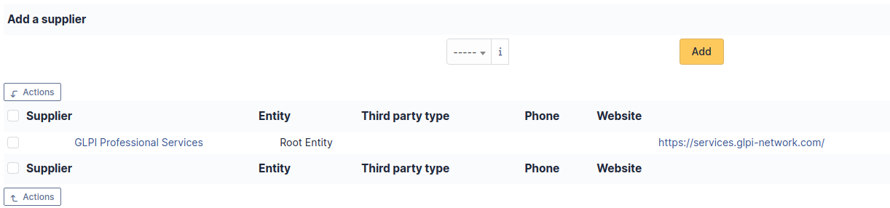

# Contacts

i-Vertix ITAM users are the persons having an authentication for the i-Vertix ITAM
application. External persons, usually associated with contracts, are
known to i-Vertix ITAM as *Contacts*.

A contact is characterized by usual identity informations as well as
title, phone number, mail address... Defining a list of contact types
allows to sort contacts by types. It is also possible to export a
contact in vCard format.

:::info

The list of possible titles for a contact is the same as the list of
possible titles for users.

:::

## The different tabs

### Suppliers

The *Suppliers* tab is used to show or add linked suppliers.

### Documents

Additional information is stored in the form of external documents which
are files uploaded into i-Vertix ITAM. In the *Documents* tab, documents can be
associated and unlinked with the selected item. The
[management of the documents themselves](../../modules/management/documents) is dealt with in another chapter.

It is also possible to quickly create a document via this tab by
specifying the desired file and optionally the field in which the new
document is to be placed. The name of the created document will be based
on the name of the added file.

:::info

When you delete a document from this tab via mass actions, you only
remove the link between the object and the document; the document
itself is still present.

:::

### Associated External Links

The *External links* tab is used to show associated external links.

For some items, external links are managed from the menu **Setup \>
External links**.

These links can use object fields such as IP, name, etc. See
[Configure protocol external links](../../modules/configuration/external_links).

Examples:

- A web link: [http://192.168.0.1](http://192.168.0.1) (IP retrieved from the network port
  of the hardware) ;
- A RDP link for remote access: itam://MSTSC.EXE,pc001 (name "pc001"
  retrieved from the hardware).

### Notes

The *Notes* tab provides a free text field for storing additional
information. Notes are displayed in the order of their creation.

### History

The *History* tab is used to show any changes made to an item. The
following information about the changes is available:

- ID of the change.
- Date and time the change was made.
- User who made the change. If this field is not filled, it means that
  the action was done automatically (For example: automatic inventory
  update).
- Field that was changed.
- Description of the change that was made.

The description of the change represents either the difference between
the old and the new value (For example with location field: Change HQ to
Remote Office A), or the explanation of the action which was carried out
(For example: Uninstallation of a software: "Gimp 2.0").

:::info

For dropdowns or objects with a parent/child relationship, the
modification of a child will appear in the history of the parent
element.

:::

### All Information

For an item, all information is displayed on one page from the *All*
tab. This shows all of the tabs of an object's form in one view, one
below the other.
