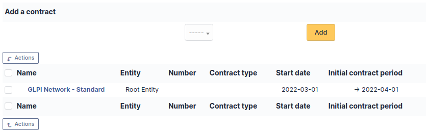

# Contracts

i-Vertix ITAM supports contracts management, in order to manage contract types
such as loan, maintenance, support...

Contracts management allows to:

- make an inventory of all contracts related to the organization assets
- integrate contracts in i-Vertix ITAM financial management
- anticipate and follow contract renewal.

:::info

It is possible to use
[templates to generate this object](../../modules/overview/templates).

:::

:::info

It is possible to receive notifications in order to be informed of
events such as contract end. When contract must be renewed expressly,
it is useful to be notified before end of contract. For periodic
contracts, it is also possible to be notified at the end of each
period. Notifications are configured at entity level, in menu **Setup
\> Notifications** to define models and destination and in menu
**Administration \> Entities** to enable notification, define default
values and a possible anticipation of notification.

:::

## Description of specific fields

- **Contract type**: by default, no contract type is defined, contract
  types must be configured in drop-down configuration;
- **Number**: contract number;
- **Start date**: date at which contract starts, all periodicity based
  events are computed using this date;
- **Initial contract period**: if this field and start date are given,
  contract end date will appear, colored in red if contract has expired;
- **Notice**: used to trigger alert notifications;
- **Account number**: used to connect with company accounting software;
- **Contract renewal period**: duration after which contract renewal is
  available;
- **Invoice period**: duration between invoices;
- **Renewal**: *Tacit* (the contract is automatically renewed if no
  party has ended it) or *Express* (needs agreement for renewal);
- **Max number of items**: attaching new items to this contract will be
  blocked when overflowing this number;
- **Support hours**: support hours as defined in the contract, it is
  possible to distinguish week days, Saturdays and Sundays/holidays.

## The different tabs

### Costs

This tab allows to define a cost related to the contract and linked to a
i-Vertix ITAM budget: the cost of the contract will be imputed to this budget.

### Suppliers

This tab allows to associate one or several suppliers to the contract.

### Associated elements

The *Items* tab is used to show or add linked assets.

### Documents

Additional information is stored in the form of external documents which
are files uploaded into i-Vertix ITAM. In the *Documents* tab, documents can be
associated and unlinked with the selected item. The
[management of the documents themselves](../../modules/management/documents) is dealt with in another chapter.

It is also possible to quickly create a document via this tab by
specifying the desired file and optionally the field in which the new
document is to be placed. The name of the created document will be based
on the name of the added file.

:::info

When you delete a document from this tab via mass actions, you only
remove the link between the object and the document; the document
itself is still present.

:::

### Associated External Links

The *External links* tab is used to show associated external links.

For some items, external links are managed from the menu **Setup \>
External links**.

These links can use object fields such as IP, name, etc. See
[Configure protocol external links](../../modules/configuration/external_links).

Examples:

- A web link: [http://192.168.0.1](http://192.168.0.1) (IP retrieved from the network port
  of the hardware) ;
- A RDP link for remote access: itam://MSTSC.EXE,pc001 (name "pc001"
  retrieved from the hardware).

### Notes

The *Notes* tab provides a free text field for storing additional
information. Notes are displayed in the order of their creation.

### History

The *History* tab is used to show any changes made to an item. The
following information about the changes is available:

- ID of the change.
- Date and time the change was made.
- User who made the change. If this field is not filled, it means that
  the action was done automatically (For example: automatic inventory
  update).
- Field that was changed.
- Description of the change that was made.

The description of the change represents either the difference between
the old and the new value (For example with location field: Change HQ to
Remote Office A), or the explanation of the action which was carried out
(For example: Uninstallation of a software: "Gimp 2.0").

:::info

For dropdowns or objects with a parent/child relationship, the
modification of a child will appear in the history of the parent
element.

:::

### Debugging information

If you have *Debug* mode enabled in your preferences, a
*Debug* tab will appear before the *All* tab. This tab offers
information to help you resolve an issue.

For example, for a computer, you have one or more tables depending on
the affected object (financial information, reservations...) listing
the notifications that will be triggered on this computer with:

- Triggering event
- Recipient(s)
- Notification model used
- Recipient(s) email address

### All Information

For an item, all information is displayed on one page from the *All*
tab. This shows all of the tabs of an object's form in one view, one
below the other.
