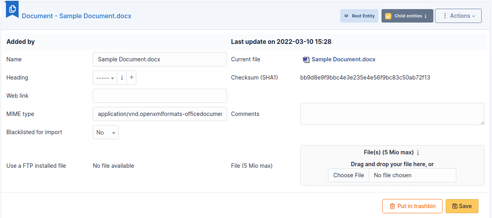

# Documents

Documents management in i-Vertix ITAM allows to store digital documents or web
links sorted under different headings.

A document is described by a **name** and an **comment** and can be
associated to a **heading**.

The file corresponding to the document can be added in several ways:

- From local disk;
- Using a web link pointing to a document (image, HTML page, PDF...);
- Using a file previously transferred with FTP to sub-folder
  */files/\_uploads/* of i-Vertix ITAM installation

A MIME type can also be given.

:::info

\* Document types authorized in i-Vertix ITAM according to their extension are
defined in **Setup** \> **Dropdowns** \> **Management** \> **Document
types** \* Document headings can be hierarchical \* The option
**Blacklisted for import** allows to exclude this document from import
by collectors; it is useful for signature images, logos...

:::

## The different tabs

### Associated elements

The *Items* tab is used to show or add linked assets.

### Documents

It is possible in i-Vertix ITAM to attach other documents to a document, which
explains why a [Document] has a [Document] tab.

### Notes

The *Notes* tab provides a free text field for storing additional
information. Notes are displayed in the order of their creation.

### History

The *History* tab is used to show any changes made to an item. The
following information about the changes is available:

- ID of the change.
- Date and time the change was made.
- User who made the change. If this field is not filled, it means that
  the action was done automatically (For example: automatic inventory
  update).
- Field that was changed.
- Description of the change that was made.

The description of the change represents either the difference between
the old and the new value (For example with location field: Change HQ to
Remote Office A), or the explanation of the action which was carried out
(For example: Uninstallation of a software: "Gimp 2.0").

:::info

For dropdowns or objects with a parent/child relationship, the
modification of a child will appear in the history of the parent
element.

:::

### All Information

For an item, all information is displayed on one page from the *All*
tab. This shows all of the tabs of an object's form in one view, one
below the other.
