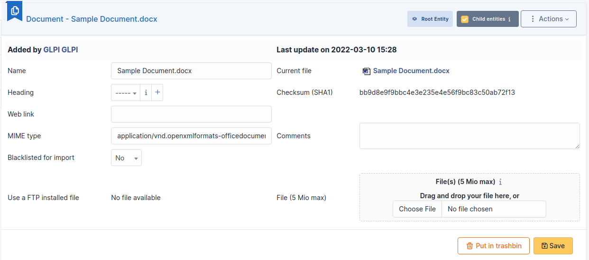

# Documents

Documents management in i-Vertix ITAM allows to store digital documents or web
links sorted under different headings.

A document is described by a **name** and an **comment** and can be
associated to a **heading**.

The file corresponding to the document can be added in several ways:

- From local disk;
- Using a web link pointing to a document (image, HTML page, PDF...);
- Using a file previously transferred with FTP to sub-folder
  */files/\_uploads/* of i-Vertix ITAM installation

A MIME type can also be given.

:::info

\* Document types authorized in i-Vertix ITAM according to their extension are
defined in **Setup** \> **Dropdowns** \> **Management** \> **Document
types** To see the different types of files that can be downloaded, go
to [this section](../../modules/management/documents.html#downloadable-file-types)
\* Document headings can be hierarchical \* The option **Blacklisted
for import** allows to exclude this document from import by
collectors; it is useful for signature images, logos...

:::

## The different tabs

### Associated Items

This field refers to all items linked to the document.

It is possible to link several types of objects to i-Vertix ITAM :

::: 
list of linkable items

- Appliance
- Battery
- Battery item
- Budget
- Camera
- Camera item
- Cartridge Model
- Case
- Case item
- Certificate
- Change
- Change task
- Cluster
- Computer
- Consumable model
- Contact
- Contract
- Controller
- Controller item
- Database instance
- Device
- Document
- Drive
- Drive item
- Entity
- Firmware
- Firmware item
- Followup
- Generic device
- Generic device item
- Graphics cards
- Graphics cards item
- Hard drive
- Hard drive item
- Knowledge base
- License
- Line
- Memory
- Memory item
- Monitor
- Network card
- Network card item
- Network device
- PCI device
- PCI device item
- Phone
- Power supply
- Power supply item
- Printer
- Problem
- Problem task
- Processor
- Processor item
- Project
- Project task
- Reminder
- Sensor
- Sensor item
- Sim card
- Sim card item
- Software
- Solution
- Sound card
- Sound card item
- Supplier
- System board
- System board item
- Ticket
- Ticket task
- User
:::

### Documents

It is possible in i-Vertix ITAM to attach other documents to a document, which
explains why a *Document* has a *Document* tab.

### Notes

The *Notes* tab provides a free text field for storing additional
information. Notes are displayed in the order of their creation. You can
also add a document

#### Add a note

- To add a note, click on **+Add**
- You can add text and format it to suit your needs
- You can add a document to this note

#### Delete a note

- To delete a note, you need to click on **delete**
- You can delete only the attachment by clicking on delete (the option
  appears when you move your mouse over the attachment)

:::tip

When you delete an attachment, it is not completely deleted, you can
find it in **Management** \> **Documents**

:::

## History

The *History* tab is used to show any changes made to an item. The
following information about the changes is available:

- ID of the change.
- Date and time the change was made.
- User who made the change. If this field is not filled, it means that
  the action was done automatically (For example: automatic inventory
  update).
- Field that was changed.
- Description of the change that was made.

The description of the change represents either the difference between
the old and the new value (For example with location field: Change HQ to
Remote Office A), or the explanation of the action which was carried out
(For example: Uninstallation of a software: "Gimp 2.0").

:::info

For dropdowns or objects with a parent/child relationship, the
modification of a child will appear in the history of the parent
element.

:::

## All Information

For an item, all information is displayed on one page from the *All*
tab. This shows all of the tabs of an object's form in one view, one
below the other.

## Downloadable file types

| NAME                               | EXTENSION | AUTHORIZED UPLOAD BY DEFAULT |
|------------------------------------|-----------|------------------------------|
| Adobe Illustrator                  | ai        | Yes                          |
| AIFF                               | aiff      | Yes                          |
| BMP                                | bmp       | Yes                          |
| BZip                               | bz2       | Yes                          |
| C header                           | h         | Yes                          |
| C source                           | c         | Yes                          |
| Comma-Separated Values             | csv       | Yes                          |
| Debian                             | deb       | Yes                          |
| DjVu                               | djvu      | Yes                          |
| DVI                                | dvi       | Yes                          |
| Excel                              | xls       | Yes                          |
| Excel                              | XML/xlsx  | Yes                          |
| Flash                              | swf       | Yes                          |
| GIF                                | gif       | Yes                          |
| GIMP multi-layer                   | xcf       | Yes                          |
| GZ                                 | gz        | Yes                          |
| HTML                               | html      | Yes                          |
| JPEG                               | jpg       | Yes                          |
| JPEG                               | jpeg      | Yes                          |
| JSON file                          | json      | Yes                          |
| LaTeX                              | tex       | Yes                          |
| Midi                               | mid       | Yes                          |
| MNG                                | mng       | Yes                          |
| MP3                                | mp3       | Yes                          |
| MPEG                               | mpg       | Yes                          |
| Oasis Open Office Base             | odb       | Yes                          |
| Oasis Open Office Calc             | ods       | Yes                          |
| Oasis Open Office Calc Template    | ots       | Yes                          |
| Oasis Open Office Chart            | odc       | Yes                          |
| Oasis Open Office Draw             | odg       | Yes                          |
| Oasis Open Office Draw Template    | otg       | Yes                          |
| Oasis Open Office HTML             | oth       | Yes                          |
| Oasis Open Office Image            | odi       | Yes                          |
| Oasis Open Office Impress          | odp       | Yes                          |
| Oasis Open Office Impress Template | otp       | Yes                          |
| Oasis Open Office Math             | odf       | Yes                          |
| Oasis Open Office Writer           | odt       | Yes                          |
| Oasis Open Office Writer Master    | odm       | Yes                          |
| Oasis Open Office Writer Template  | ott       | Yes                          |
| Ogg Vorbis                         | ogg       | Yes                          |
| OpenOffice                         | sxw       | Yes                          |
| OpenOffice Calc                    | sxc       | Yes                          |
| OpenOffice Impress                 | sxi       | Yes                          |
| Pascal                             | pas       | Yes                          |
| PDF                                | pdf       | Yes                          |
| Photoshop                          | psd       | Yes                          |
| PNG                                | png       | Yes                          |
| PostScript                         | eps       | Yes                          |
| PostScript                         | ps        | Yes                          |
| PowerPoint                         | ppt       | Yes                          |
| PowerPoint                         | XML/pptx  | Yes                          |
| QuickTime                          | mov       | Yes                          |
| QuickTime                          | question  | Yes                          |
| RealAudio                          | ra        | Yes                          |
| RealAudio                          | ram       | Yes                          |
| RealAudio                          | rm        | Yes                          |
| RedHat/Mandrake/SuSE               | rpm       | Yes                          |
| RTF                                | rtf       | Yes                          |
| Scalable Vector Graphics           | svg       | Yes                          |
| StarOffice                         | sdd       | Yes                          |
| StarOffice                         | sdw       | Yes                          |
| Stuffit                            | sit       | Yes                          |
| texte                              | txt       | Yes                          |
| TGZ                                | tgz       | Yes                          |
| TIFF                               | tif       | Yes                          |
| WAV                                | wav       | Yes                          |
| Windows Media                      | asf       | Yes                          |
| Windows Media                      | avi       | Yes                          |
| Windows Media                      | wmv       | Yes                          |
| Word                               | doc       | Yes                          |
| Word                               | XML/docx  | Yes                          |
| xml                                | xml       | Yes                          |
| zip                                | zip       | Yes                          |
