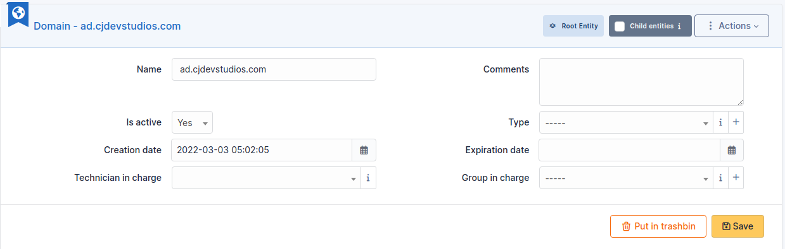
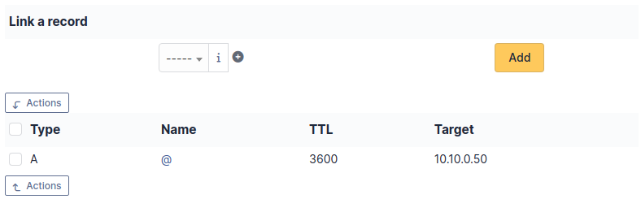

# Domains

Domains management in i-Vertix ITAM allows to manage domains (i.e. Internet
domains) and domain records:

- Inventorying domain names;
- Inventorying domain records;
- Anticipating and following domain names renewal;
- Integrating domains in i-Vertix ITAM financial management;
- Linking assets to domains;
- Include domains and records in i-Vertix ITAM assistance.

:::info

Access to list of domain *Records* is done via the list of
*Domains*.

:::

## Domain object

A *Domain* object represents an Internet domain, with its
name, expire date... This object can be attached to other objects in
i-Vertix ITAM assistance (tickets, problems, changes).

## The different tabs

### Impact Analysis

[Impact analysis](../../tabs/impact_analysis.md)
enables an infrastructure diagram to be drawn up, showing the
dependencies and impacts in the event of equipment loss. This can be
saved and exported

### Records

This tab allow to create or select a domain record to be associated with
the domain. For more information, go to
[domains records](../../modules/management/domains_records.md)

### Items

List of all other linked i-Vertix ITAM [Items](../../tabs/item.md). You can manually add an item by selecting it from the
drop-down list.

### Management

[Management](../../modules/tabs/management.md) of
financial and administrative information, this information is visible in
the 'Management' tab on the object form.

### Tickets

View all [tickets](../../modules/tabs/tickets.md)
linked to the computer

### Problems

This tab refers to all hardware-related
[problems](../../modules/assistance/problems.md).
Problems can also be linked to tickets, projects, etc. This allows you
to have a complete scenario when necessary.

### Changes

[Changes](../../modules/assistance/changes.md) lists
all changes related to a material. From this tab, you can't link a
change directly, you can do it from **Assistance** \> **Changes** \>
**Items**. You can create a new change from this page, which will be
linked to the material you have selected.

### Contracts

i-Vertix ITAM supports [contracts](../../modules/management/contract.md) management, in order to manage contract types such as loan,
maintenance, support...

Contracts management allows to:

- make an inventory of all contracts related to the organization assets
- integrate contracts in i-Vertix ITAM financial management
- anticipate and follow contract renewal.

### Documents

The [document](../../modules/management/documents.md) tab lets you link different types of file to a material
(PDF, txt, png, etc.) You can attach a document already uploaded to i-Vertix ITAM
or add a new one directly from this tab.

### Certificates

Link a
[certificate](../../modules/management/certificates.md) to your registration

## History

The *History* tab is used to show any changes made to an item. The
following information about the changes is available:

- ID of the change.
- Date and time the change was made.
- User who made the change. If this field is not filled, it means that
  the action was done automatically (For example: automatic inventory
  update).
- Field that was changed.
- Description of the change that was made.

The description of the change represents either the difference between
the old and the new value (For example with location field: Change HQ to
Remote Office A), or the explanation of the action which was carried out
(For example: Uninstallation of a software: "Gimp 2.0").

:::info

For dropdowns or objects with a parent/child relationship, the
modification of a child will appear in the history of the parent
element.

:::

## All Information

For an item, all information is displayed on one page from the *All*
tab. This shows all of the tabs of an object's form in one view, one
below the other.
