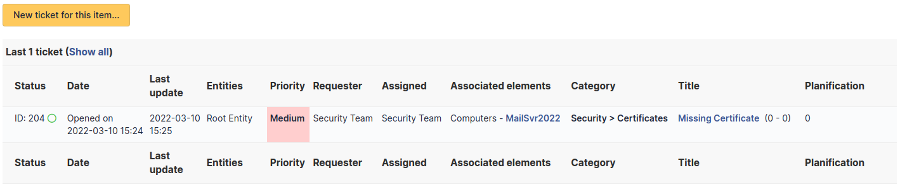
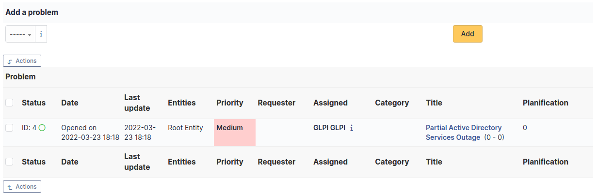

# Suppliers

i-Vertix ITAM supports suppliers management, in order to identity the supplier of
an asset in asset management but also to attribute tickets to the
supplier, either a person or a company.

When buying an equipment of make X from supplier Y, two distinct
information must be managed in i-Vertix ITAM: the vendor (X) and the supplier
(Y).

A supplier is characterized by a name, a third party type, a location
(address, postal code, town, country) and a contact (web site, phone,
fax...).

Supplier management allows to:

- reference all suppliers of organization assets
- ease contact in case of incident
- include suppliers in i-Vertix ITAM assistance

## -The different tabs 

### Associated Contacts

The *Contacts* tab is used to show or add linked contacts.

:::info

There is a clear distinction between a supplier (which can be attached
to assets) and a contact (which are the persons allowing to contact
the supplier). Therefore, a supplier must be associated with contacts.

Example : M. Doe is sale assistant in company Foo. Create a supplier
named Foo. Create a contact for M. Doe. Assign to this contact the
type "Sale" Attach the contact to supplier Foo

:::

### Associated Contracts

The *Contracts* tab is used to show or add linked contracts.

For each associated contract, the name, number, contract type, supplier,
start date and initial duration of the contract are listed. In the last
field, the end date of the contract is also shown with a red display if
the date is earlier than the current date.

Refer to
[contract management](../../modules/management/contract) for more information.

### Associated elements

The *Items* tab is used to show or add linked assets.

### Documents

Additional information is stored in the form of external documents which
are files uploaded into i-Vertix ITAM. In the *Documents* tab, documents can be
associated and unlinked with the selected item. The
[management of the documents themselves](../../modules/management/documents) is dealt with in another chapter.

It is also possible to quickly create a document via this tab by
specifying the desired file and optionally the field in which the new
document is to be placed. The name of the created document will be based
on the name of the added file.

:::info

When you delete a document from this tab via mass actions, you only
remove the link between the object and the document; the document
itself is still present.

:::

### Tickets

The *Tickets* tab is used to create a ticket associated with the current
object. It also lists the tickets already linked to the object.

:::info

A second table lists the tickets attached to the linked elements

:::

:::info

Any deletion or addition of a ticket is recorded in the history.

:::

### Problems

The *Problems* tab is used to create a problem associated with the
current object. It also lists the changes already linked to the object.

This summary table includes for each object:

- Status
- Date (opening or expiry date, resolution or closing date depending on
  the status of the problem)
- Priority
- Requestor(s) and assigned technician(s)
- Associated elements
- Category
- Name
- Column indicating the number of scheduled tasks

:::info

A second table lists the problems attached to the related elements

:::

:::info

Any deletion or addition of a problem is recorded in the history.

:::

### Changes

The *Changes* tab is used to create a change associated with the current
object. It also lists the changes already linked to the object.

This summary table includes the following fields for each object:

- Status
- Date (opening or expiry date, resolution or closing date depending on
  the status of the change)
- Priority
- Requestor(s) and assigned technician(s)
- Associated elements
- Category
- Name
- Number of scheduled tasks

:::info

A second table lists the changes attached to the related elements

:::

:::info

Any deletion or addition of a change is recorded in the history.

:::

### Associated External Links

The *External links* tab is used to show associated external links.

For some items, external links are managed from the menu **Setup \>
External links**.

These links can use object fields such as IP, name, etc. See
[Configure protocol external links](../../modules/configuration/external_links).

Examples:

- A web link: [http://192.168.0.1](http://192.168.0.1) (IP retrieved from the network port
  of the hardware) ;
- A RDP link for remote access: glpi://MSTSC.EXE,pc001 (name "pc001"
  retrieved from the hardware).

### Notes

The *Notes* tab provides a free text field for storing additional
information. Notes are displayed in the order of their creation.

### Knowledge base

The *Knowledge base* tab is used to show or add linked knowledge base
articles.

### History

The *History* tab is used to show any changes made to an item. The
following information about the changes is available:

- ID of the change.
- Date and time the change was made.
- User who made the change. If this field is not filled, it means that
  the action was done automatically (For example: automatic inventory
  update).
- Field that was changed.
- Description of the change that was made.

The description of the change represents either the difference between
the old and the new value (For example with location field: Change HQ to
Remote Office A), or the explanation of the action which was carried out
(For example: Uninstallation of a software: "Gimp 2.0").

:::info

For dropdowns or objects with a parent/child relationship, the
modification of a child will appear in the history of the parent
element.

:::

### All Information

For an item, all information is displayed on one page from the *All*
tab. This shows all of the tabs of an object's form in one view, one
below the other.
