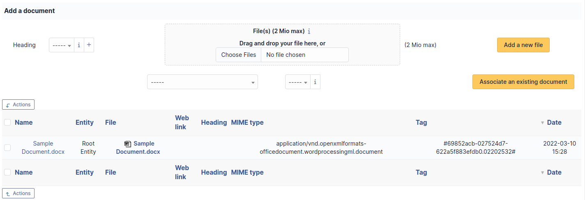

# Manage knowledge base

i-Vertix ITAM knowledge base has two main targets:

- Gather internal knowledge for technicians;
- Provide information as a public FAQ to enable users to solve simple
  problems on their own.

:::info

Only public FAQ items are visible to users of simplified interface.
Other elements are visible only to technicians via standard interface.

:::

Each article of the knowledge base must have one or more targets, being
entities, groups, profiles or users, to be readable. As long as an
article has no target, it is visible only by its writer, is flagged as
[unpublished] and appears in table [Unpublished
articles] on the home page of the knowledge base.

:::info

You can publish an article for everyone by targeting the root entity.

:::

By default, articles are not translatable. However, this functionality
can be activated, see
[general configuration](../../modules/configuration/general/general_configuration).

It is possible to attach documents to articles of the knowledge base.

:::info

An article can be made visible during a time slot by defining a start
date and an end date.

:::

:::warning

Elements which should not be interpreted when displayed can be defined
with preformated style (`<pre>` in HTML). Tags like `<VirtualHost>`
can therefore be inserted and will be displayed. Other HTML tags
(`<TAG>...</TAG>` may disappear when editing; to have complete
visibility of the text, it is possible to switch to HTML mode where
all elements will be visible. The browser may also modify dynamically
content (case change, tags adding) when editing.

:::

It is possible to create categories and sub-categories in order to
organize browsing (see
[Configure drop-downs](../../modules/configuration/dropdowns)). User can then use several tabs to search and browse
knowledge base:

- **Search** This tab is the default tab, displaying recent articles,
  popular articles and last changes. It allows also to search inside
  knowledge base.

  

- **Browse** This tab allows to browse tree structure of categories.

  

- **Manage** This tab is only visible for knowledge base administrators.
  Depending on user's permissions, it is possible to access quickly
  user's articles, user's unpublished articles, all unpublished
  articles...

  

:::info

The knowledge base search engine provides operators for complex
search: `+ - ~ \< > * ” ” ()`.

- `+`: word must be there;

- `-`: word must not be there;

- `*`: truncate suffix;

- `" "`: contained sequence must be searched literally;

- `< >`: define order on search elements;

- `()`: group when using \< and \>.

Examples :

- printer failure
-> Search lines containing at least one of these words

- +printer +failure
-> Search lines containing both words

- +mail thunderbird
-> Search lines containing word *mail* but rank higher lines containing also word *thunderbird*

- +mail -outlook
-> Search lines containing word *mail* but not word *outlook*

- * +mail +(>thunderbird \<outlook)
-> Search lines containing word *mail* and *thunderbird*, or *mail* and *outlook*, in any order, but rank *mail thunderbird* higher than *mail outlook*

- open*
-> Search lines containing words such as *openoffice*, *openwriter*, *openbar*, *openphp*...

- "openoffice suite"
-> Search lines containing exactly sentence *openoffice suite*

:::

## The different tabs of an article

### Knowledge base

This tab displays a table with article category, subject, content,
writer, creation date, last modification date, number of views and FAQ
membership.

If an article is unpublished (i.e. has no target), this information will
appear in red above number of views.

### Target

This tab allows to manage article's targets.

An article is by default personal and therefore only visible by its
creator.

For an article to become visible by other users, targets must be added
to it, a target being either an entity, a group, a profile or a user who
will be able to consult the article.

### Edit

This tab allows, if appropriate permission, to modify or delete an
article.

### Associated elements

The *Items* tab is used to show or add linked assets.

### Documents

Additional information is stored in the form of external documents which
are files uploaded into i-Vertix ITAM. In the *Documents* tab, documents can be
associated and unlinked with the selected item. The
[management of the documents themselves](../../modules/management/documents) is dealt with in another chapter.

It is also possible to quickly create a document via this tab by
specifying the desired file and optionally the field in which the new
document is to be placed. The name of the created document will be based
on the name of the added file.

:::info

When you delete a document from this tab via mass actions, you only
remove the link between the object and the document; the document
itself is still present.

:::

### History

The *History* tab is used to show any changes made to an item. The
following information about the changes is available:

- ID of the change.
- Date and time the change was made.
- User who made the change. If this field is not filled, it means that
  the action was done automatically (For example: automatic inventory
  update).
- Field that was changed.
- Description of the change that was made.

The description of the change represents either the difference between
the old and the new value (For example with location field: Change HQ to
Remote Office A), or the explanation of the action which was carried out
(For example: Uninstallation of a software: "Gimp 2.0").

:::info

For dropdowns or objects with a parent/child relationship, the
modification of a child will appear in the history of the parent
element.

:::

### Revision

This tab allows to consult all article revisions: each saved
modification of the article will create a revision storing the previous
version of the article.

Revisions can be shown and restored.

### Comments

This tab allows platform's users to add their comments and discuss the
article.

### All Information

For an item, all information is displayed on one page from the *All*
tab. This shows all of the tabs of an object's form in one view, one
below the other.
