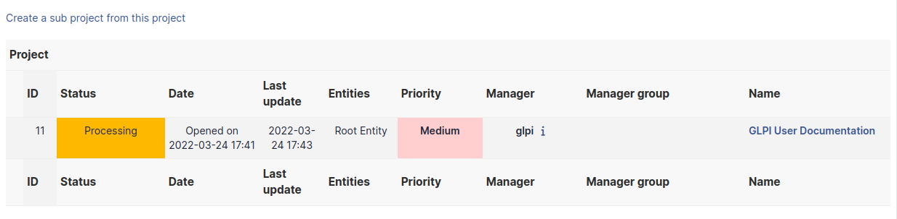
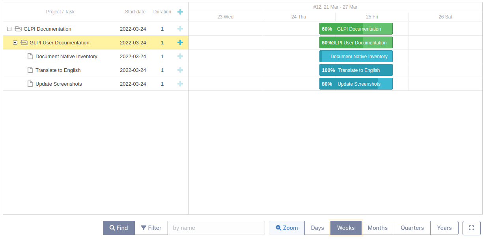
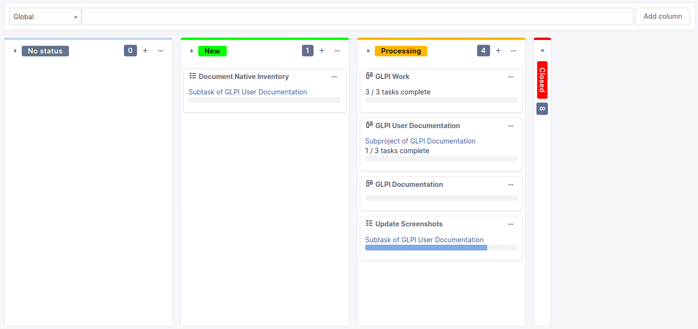

# Manage projects

Project management in i-Vertix ITAM allows to follow entirely a project's
progress by creating tasks and building teams; projects can be
optionally linked to a
[change](/asset-management/modules/assistance/changes).

A i-Vertix ITAM project allows:

- defining tasks associated to the project and following their progress;
- creating teams for a project and its tasks;
- triggering sub-projects inside the project;
- building GANTT diagrams;
- using Kanban method;
- attaching costs;
- linking to i-Vertix ITAM ITIL items.

A project can be hierarchical, a project can therefore have
sub-projects.

A project is characterized by name, code, state, type, provisional and
real dates, percent done.

Distinct management teams can by composed of users, groups, suppliers
and contacts.

Several GANTT diagrams are available for each project (see tab *GANTT*).

Project management relies on two types of items: project and project
task.

## Project

### The different tabs

### Project tasks

This tab allows to add new tasks to the project. It displays also
already defined tasks with, for each task, its name, type, status,
planned start and end dates, real start and end dates, percent done and
parent task name.

### Project team

This tab allows to add new members to the project team, this member
being a contact, a supplier or a group. It lists also members of project
team with for each member its type.

### Project

This tab displays project's sub-projects. A sub-project is defined the
same way as a project, the only difference being that the field [As
child of] is defined.

### GANTT

A GANTT diagram is available for each project. A global GANTT diagram is
also available, including projects defined as visible in this global
diagram (field [Show on global GANTT] of the project form).

### Kanban

This tab provides an interface to use Kanban method.

For more information about the Kanban feature, please refer to the
[full documentation](/asset-management/modules/overview/kanban).

### Costs

Costs can be attached to projects; the costs of the tickets attached to
project's tasks will sum up to these costs.

### ITIL objects

This tab allows to attach to the project i-Vertix ITAM ITIL objects: tickets,
problems and changes. It is also possible to create these objects
directly from this tab.

### Associated elements

The *Items* tab is used to show or add linked assets.

### Documents

Additional information is stored in the form of external documents which
are files uploaded into i-Vertix ITAM. In the *Documents* tab, documents can be
associated and unlinked with the selected item. The
[management of the documents themselves](/asset-management/modules/management/documents) is dealt with in another chapter.

It is also possible to quickly create a document via this tab by
specifying the desired file and optionally the field in which the new
document is to be placed. The name of the created document will be based
on the name of the added file.

:::info

When you delete a document from this tab via mass actions, you only
remove the link between the object and the document; the document
itself is still present.

:::

### Associated Contracts

The *Contracts* tab is used to show or add linked contracts.

For each associated contract, the name, number, contract type, supplier,
start date and initial duration of the contract are listed. In the last
field, the end date of the contract is also shown with a red display if
the date is earlier than the current date.

Refer to
[contract management](/asset-management/modules/management/contract) for more information.

### Notes

The *Notes* tab provides a free text field for storing additional
information. Notes are displayed in the order of their creation.

### History

The *History* tab is used to show any changes made to an item. The
following information about the changes is available:

- ID of the change.
- Date and time the change was made.
- User who made the change. If this field is not filled, it means that
  the action was done automatically (For example: automatic inventory
  update).
- Field that was changed.
- Description of the change that was made.

The description of the change represents either the difference between
the old and the new value (For example with location field: Change HQ to
Remote Office A), or the explanation of the action which was carried out
(For example: Uninstallation of a software: "Gimp 2.0").

:::info

For dropdowns or objects with a parent/child relationship, the
modification of a child will appear in the history of the parent
element.

:::

### Debugging information

If you have [Debug] mode enabled in your preferences, a
*Debug* tab will appear before the *All* tab. This tab offers
information to help you resolve an issue.

For example, for a computer, you have one or more tables depending on
the affected object (financial information, reservations...) listing
the notifications that will be triggered on this computer with:

- Triggering event
- Recipient(s)
- Notification model used
- Recipient(s) email address

### All Information

For an item, all information is displayed on one page from the *All*
tab. This shows all of the tabs of an object's form in one view, one
below the other.

## Project task

Task item is quite similar to a project.

A project task can also be a project sub-task.

A task is characterized by name, state, type, provisional and real
dates, percent done.

Distinct management teams can by composed of users, groups, suppliers
and contacts.

:::info

A project task is not an independent item, it can only be accessed
through the [Project tasks] tab of the project owning the
task.

:::

Tasks can be attached to tickets in order to plan interventions.

Planned and actual duration are also defined for a task, reported at
project level together with attached tickets duration.

## The different tabs

### Project tasks

This tab allows to display and add sub-tasks.

### Task team

This tab defines the team in charge of the task.

### Documents

Additional information is stored in the form of external documents which
are files uploaded into i-Vertix ITAM. In the *Documents* tab, documents can be
associated and unlinked with the selected item. The
[management of the documents themselves](/asset-management/modules/management/documents) is dealt with in another chapter.

It is also possible to quickly create a document via this tab by
specifying the desired file and optionally the field in which the new
document is to be placed. The name of the created document will be based
on the name of the added file.

:::info

When you delete a document from this tab via mass actions, you only
remove the link between the object and the document; the document
itself is still present.

:::

### Tickets

The *Tickets* tab is used to create a ticket associated with the current
object. It also lists the tickets already linked to the object.

:::info

A second table lists the tickets attached to the linked elements

:::

:::info

Any deletion or addition of a ticket is recorded in the history.

:::

### Notes

The *Notes* tab provides a free text field for storing additional
information. Notes are displayed in the order of their creation.

### History

The *History* tab is used to show any changes made to an item. The
following information about the changes is available:

- ID of the change.
- Date and time the change was made.
- User who made the change. If this field is not filled, it means that
  the action was done automatically (For example: automatic inventory
  update).
- Field that was changed.
- Description of the change that was made.

The description of the change represents either the difference between
the old and the new value (For example with location field: Change HQ to
Remote Office A), or the explanation of the action which was carried out
(For example: Uninstallation of a software: "Gimp 2.0").

:::info

For dropdowns or objects with a parent/child relationship, the
modification of a child will appear in the history of the parent
element.

:::

### All Information

For an item, all information is displayed on one page from the *All*
tab. This shows all of the tabs of an object's form in one view, one
below the other.
