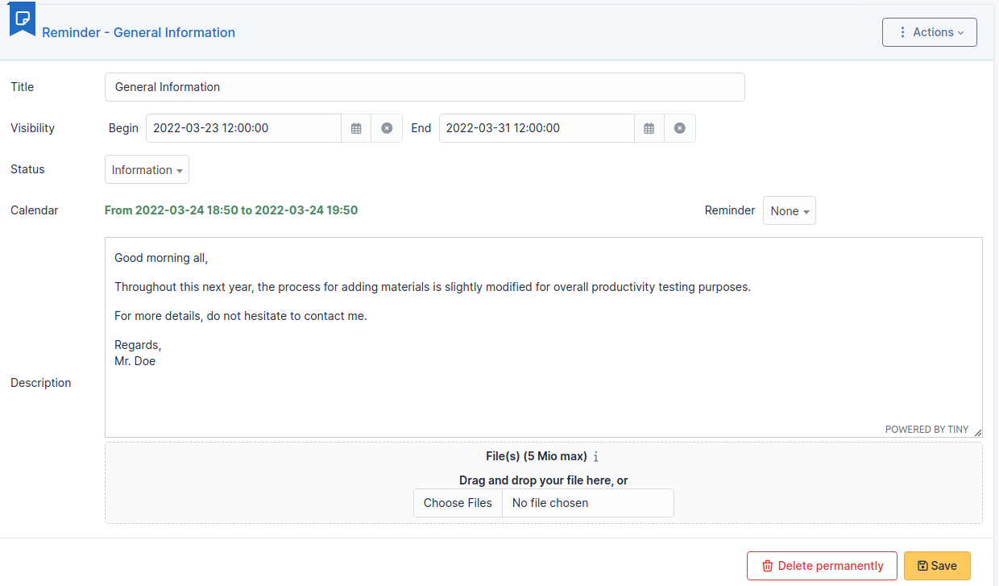
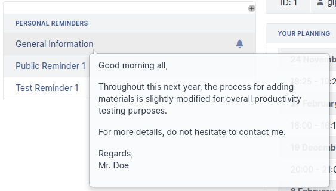
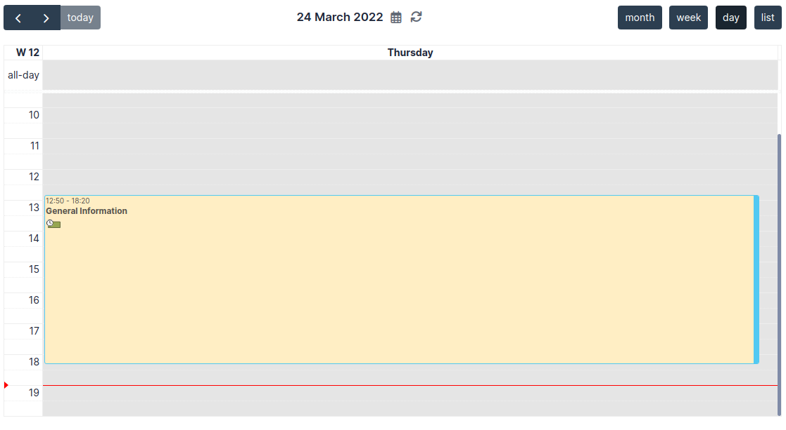
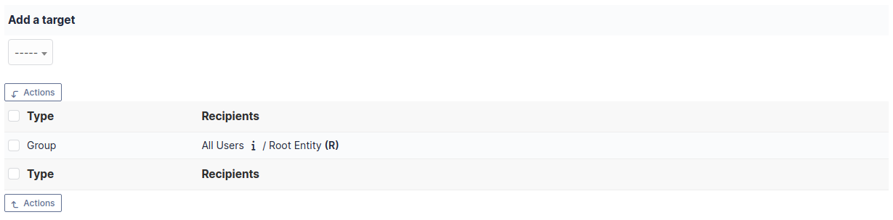

# Manage personal or public reminders

A reminder in i-Vertix ITAM is simple text with attached files; it allows to
transmit information to other users of the platform.

A reminder is characterized by:

- a lifetime;
- a status;
- the possibility to appear in planning;
- its targets.

The created reminders will then appear in i-Vertix ITAM home page or in targeted
users' planning.

:::info

It is possible to add a start date and an end date for each reminder.
If no start date is given, the reminder will be visible immediately
and until its end date. If no end date is given, the reminder will be
visible permanently starting from its start date.

Adding a reminder to the planning makes it visible for targeted users
of the reminder: the owner for a personal reminder, all users'
plannings for a public note. A planned reminder is not deleted after
its end date.

:::

## The different tabs

### Documents

Additional information is stored in the form of external documents which
are files uploaded into i-Vertix ITAM. In the *Documents* tab, documents can be
associated and unlinked with the selected item. The
[management of the documents themselves](/asset-management/modules/management/documents) is dealt with in another chapter.

It is also possible to quickly create a document via this tab by
specifying the desired file and optionally the field in which the new
document is to be placed. The name of the created document will be based
on the name of the added file.

:::info

When you delete a document from this tab via mass actions, you only
remove the link between the object and the document; the document
itself is still present.

:::

### Target

A reminder is personal by default and therefore only visible for its
writer.

For a reminder to be visible by other users (public reminder), it is
necessary to add targets to the reminder. Possible targets are entity,
profile, group or users.

A public reminder is visible by users associated with a profile if this
profile has read permission for public reminders.

### History

The *History* tab is used to show any changes made to an item. The
following information about the changes is available:

- ID of the change.
- Date and time the change was made.
- User who made the change. If this field is not filled, it means that
  the action was done automatically (For example: automatic inventory
  update).
- Field that was changed.
- Description of the change that was made.

The description of the change represents either the difference between
the old and the new value (For example with location field: Change HQ to
Remote Office A), or the explanation of the action which was carried out
(For example: Uninstallation of a software: "Gimp 2.0").

:::info

For dropdowns or objects with a parent/child relationship, the
modification of a child will appear in the history of the parent
element.

:::

### All Information

For an item, all information is displayed on one page from the *All*
tab. This shows all of the tabs of an object's form in one view, one
below the other.
