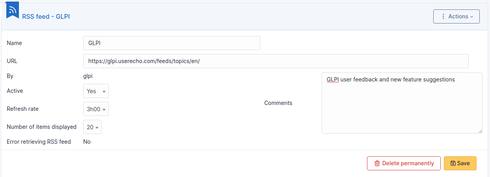

# Manage RSS feeds

i-Vertix ITAM allows to include RSS feeds in tool home page.

A RSS feed is by default personal and therefore only visible by its
creator.

For a RSS feed to become public and visible by other users, targets must
be added to it, a target being either an entity, a group, a profile or a
user.

:::info

A public RSS feed is visible by users associated with a profile if
this profile has read permission for public RSS feeds.

:::

## The different tabs

### Content

This tab allows to consult the number of displayed items; this content
is the one displayed on home page.

### Targets

This tab allows to display and modify the list of targets of the RSS
feed.

## History

The *History* tab is used to show any changes made to an item. The
following information about the changes is available:

- ID of the change.
- Date and time the change was made.
- User who made the change. If this field is not filled, it means that
  the action was done automatically (For example: automatic inventory
  update).
- Field that was changed.
- Description of the change that was made.

The description of the change represents either the difference between
the old and the new value (For example with location field: Change HQ to
Remote Office A), or the explanation of the action which was carried out
(For example: Uninstallation of a software: "Gimp 2.0").

:::info

For dropdowns or objects with a parent/child relationship, the
modification of a child will appear in the history of the parent
element.

:::

## All Information

For an item, all information is displayed on one page from the *All*
tab. This shows all of the tabs of an object's form in one view, one
below the other.
