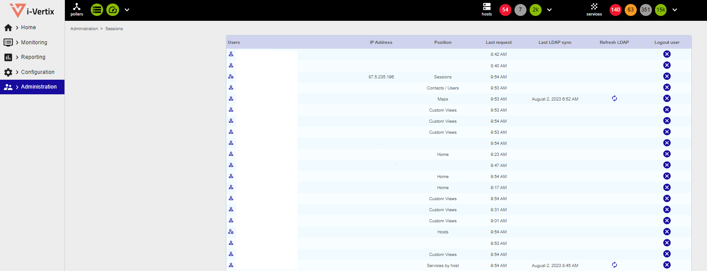

## Sessions
In **Administration** > **Sessions** you can see the sessions of users who have logged in to the i-Vertix monitoring infrastructure.

The information reported are:
1. username
2. source ip
3. page the user is currently on
4. last logged request
5. last sync with LDAP (if available)
6. LDAP refresh
7. force logout of the user