## Editing

### Adding objects

From **Monitoring -> Maps** page, click on the map you want to edit, then click on Edit at the top right corner to enter **Edit mode** 

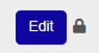

To save the changes applied to the map, click on **Save Map**.

To discard them click on **Reset**. 

To get back to map visualization, click on **Exit Edit Mode**.

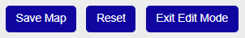

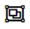 **Select objects** icon (available only for graphical maps): allows you to select one or more objects and reposition it/them on the map

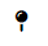 **Create a new marker** icon (available for both graphical and geographical maps): allows you  to **add a new object** on the map.

The **object** has the following **properties**:

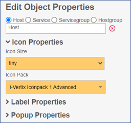

* **Object type**: Host, Service, Servicegroup or Hostgroup
* **Icon Properties**: select **icon size** and the **icon pack** that is to be used
* **Label Properties**: if the label is enabled, it is possible to decide what information to display, its position relative to the object, size and color.
* **Popup Properties**: to select/change popup messages settings and configure which information they should include

### Adding Links

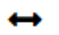 **Create a new line** icon: to add a new line/link between 2 objects

The object has the following properties:

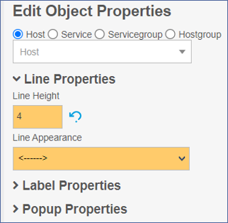

* **Object type**: Host, Service, Servicegroup or Hostgroup
* **Line Properties**: you can select the **thickness** of the line and the line **appearance** 

* **Performance Data Interpreter**: it can be used to select which performance metrics have to be displayed and the position of their values.

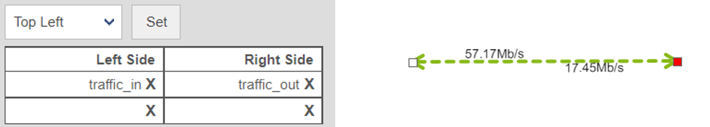

* **Label Properties**: if the label is enabled, it is possible to decide what information to display, its position relative to the object, size and color.
* Popup Properties: to select/change popup messages settings and configure which information they should include

### Adding Gadgets

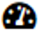 **Create a new gadget icon**.

Select the **service** that has to be represented by the new Gadget.

If in **Gadget Properties > Gadget** Type you select Map, instead of a service, you have to select the map that will be displayed within/inside the current one (i.e. the one you are editing). 

**Gadget Properties**: 
* **Gadget Type**: Gauge, Performance Graph, Big Text, Map
* **Gadget Size**
* **Gadget Opacity**

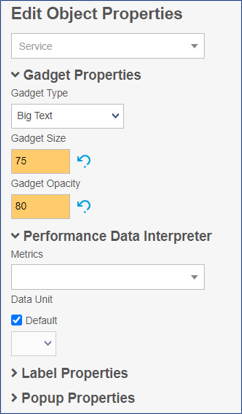

**Performance Data Interpreter**
* **Metrics** select the performance metric that has to be displayed
* **Data unit**

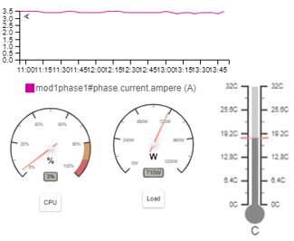

**Label Properties**: if the label is enabled, it is possible to decide what information to display, its position relative to the object, size and color.

**Popup Properties**: to select/change popup messages settings and configure which information they should include

