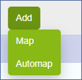
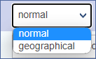

## Graphical (Normal) and Geographical Maps Configuration

From **Configuration  >  Maps** click on **Add**  and select **Map**. 

Add a Map window opens. In General tab, enter:

### General

* **Map Name**: enter a meaningful name
* **Type**: select from the dropdown menu **normal** (if you want a graphical map) or **geographical**

* **Background**: in case of a graphical/normal map, select the background image
* **Use background as Thumbnail**: automatically generates a thumbnail using your customized map background. This option  is applicable only to Graphical/Normal maps
* **Thumbnail**: the custom thumbnail that will be associated with the map and displayed in the Monitoring > Map menu. If no thumbnail is set, a default thumbnail will be used.
* **Enable object popups**: Clicking on an object will bring up a popup that displays multiple details about the object. These details can be configured in "Popup Information" and can be changed later for each individual object. 
* **Enable Labels**: An object label will be displayed, which can be customized in "Defaults" settings.
* **Always enable map adjustment**: Upon closing popups, the map will automatically adjust its view. If this option is disabled, you can still access this function temporarily via the slider located on the top left corner of the map view.
* **Show Alerts**: When enabled, icons whose status changes to warning, critical, or unknown will be highlighted for 20 seconds.
* **Status**: enables or disables the map

### ACL

* **Access groups**: To share a map with other users, you can assign Access Groups to it. Only users who belong to the designated Access Groups will be able to access the map. By linking a Menu Access to the Access Group, you can specify whether users with the Access Group can modify the map or just view it. 

## Automap Maps Configuration

**From Configuration  >  Maps** click on **Add**  and select **Automap**.

**Add a Automap** window opens.

### General

* **Map Name** 
* **Thumbnail**: the custom thumbnail that will be associated with the map and displayed in the Monitoring > Map menu. If no thumbnail is set, a default thumbnail will be set.
* **Status**: enables or disables the map

### Appearance

* **Label**: When enabled, host names will appear below each circle. This feature is disabled by default.
* **Arrows**: When enabled, arrows indicating the parent-child relationship will be visible. Enabled by default.
* **Line weight**: This setting controls the thickness of the lines, which is 1px by default.

### Filter

* **Hostgroups**: When hostgroups are specified, only hosts that match those groups will be displayed. By default it’s empty.
* **Pollers**: When pollers are specified, only hosts that match those pollers will be displayed. This setting is empty by default.

### ACL

* **Access groups**: To share a map with other users, you can assign Access Groups to it. Users belonging to the designated Access Groups will be granted access to the map. By linking a Menu Access to the Access Group, you can specify whether users with the Access Group can only view the map or also modify it.

:::note

Automaps do not allow changing the location of displayed hosts or the relationships directly from the map.

:::