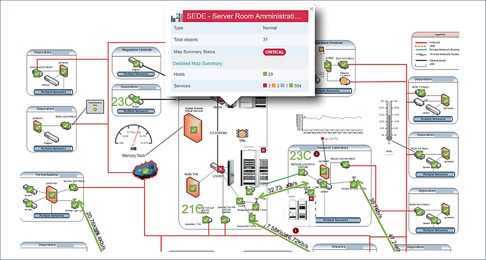
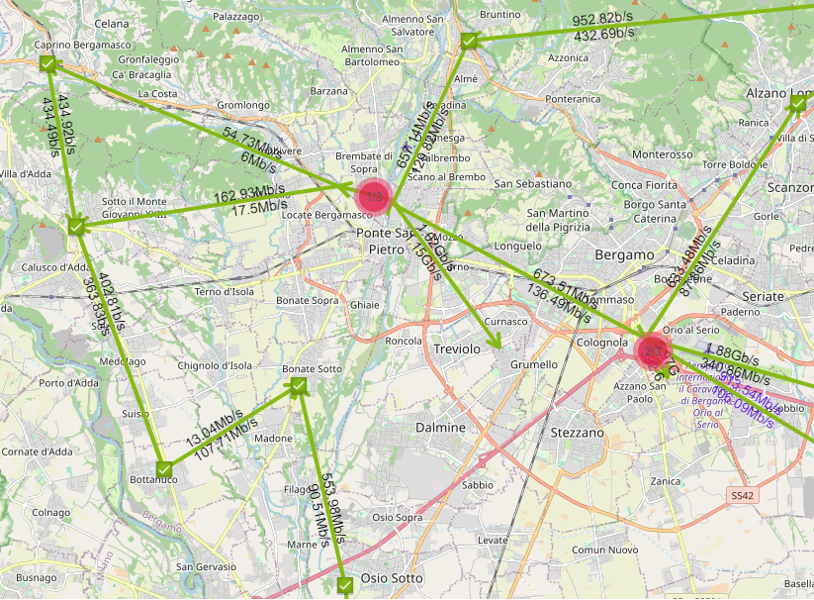
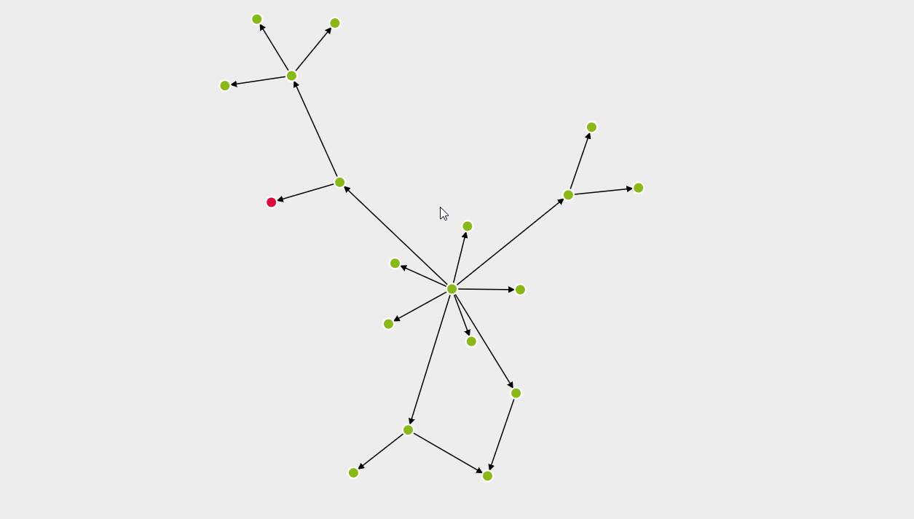

## Overview

Maps display **Host and Services health status information**, but they can also display **performance indicators** in **near real time**.

Maps can be configured from **Configuration  >  Maps menu**. Three types of maps are available:

### Graphical (normal) map

This type of map lets the user upload an image (such as a campus/building/floor map, a rack picture or a Visio network map screenshot) and use it as a static background, on which the user can place monitored Hosts and their Services.
Supported image formats are **.jpg .png .tiff** and **.bmp.**  
A shortcut/link to another map can also be placed in a map. 

### Geographical map

This type of map shows the position of monitored Hosts, on a **dynamic geographical** map.
It can be useful to display geographically distributed networks. 
Geolocalization is performed through an integration with <u>www.openstreetmap.org</u> via its APIs.

### Automap

These maps show **connectivity relations** among monitored devices. 
To configure such parent-child relations go to **Configuration  >  Hosts  > Hosts**, select a Host, and go to its Relations tab. 
**VMware discovery and Network Discovery automatically create them**.

To Add a new map, from **Configuration  >  Maps** click on **Add** 

Select **Map** to add a Graphical (Normal) map or a Geographical one, or **Automap**

See the following thread for:

1. [Maps configuration](managing-maps.md)

2. [Edit maps](edit-maps.md)

3. [Visualize maps](visualize-maps.md)

