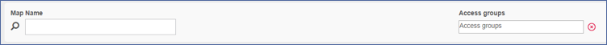
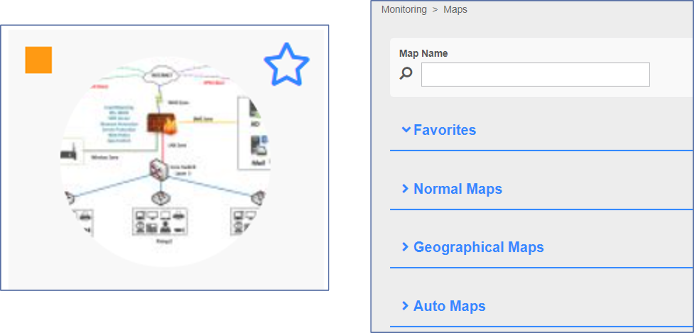

Previously created maps can be managed from **Monitoring -> Maps** menu. They are grouped in different sections/categories: Favorites, Normal Maps, Geographical Maps, Auto Maps.

From this page maps can be viewed or edited.

Search boxes are available, to filter/search for maps based on their names or Access groups.

On the top left corner of the map preview, a **color-coded square icon** represents the status of the hosts/services that are included in the map: if there is at least one Host/Service in warning or critical status, the icon will take on the color of the one with the **highest severity**. If all Hosts/Services included in the map are UP, then the little square icon will be green.

To include the map in **Favorites** category, click on the **star** at the top right corner of the map preview box.

To check who created the map, hover the mouse over the map preview.

To view a map in full screen or edit it, click on its preview.

