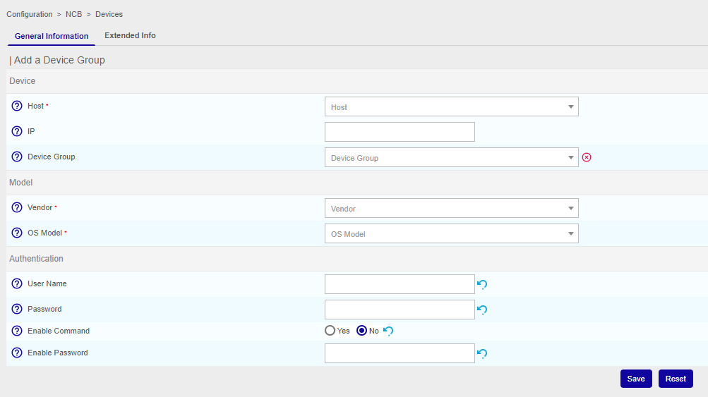

## How to configure

Go to **Configuration > NCB > Devices** and press **ADD**

### Add device

**General information tab**

* Host: select the network device being monitored
* IP: the IP address of the device
* Device Group: the device group for the device. Assigning/changing a device group will assign username and passwords for authentication on the device.

**Model**

* Vendor: select the vendor of the device
* OS Model: select the OS type of the device

**Authentication**

* User Name: the username used to log in
* Password: the password used for log in
* Enable Command: select Yes if the device uses an enable mode
* Enable Password: fill with the password if the device uses an enable mode

Press **Save**

**Extended info tab**

**Additional information**

* Status: the rule can be Enabled, Disabled or Default
* Comments: text field used for notes or comments

### Add device group

Go to **Configuration > NCB > Devices group** and press **ADD**

Device Group
 Device Group Name *	
Authentication
 User Name	
 Password	
Enable Command	Yes No
 Enable Password	
Devices
Removing or changing the devices associated to this Devicegroup will have impacts to the authentication information of the device
 Devices	

ACL
 Access groups *