# Smart Poller Configuration

## Poller configuration

To attach a Smart Poller to a Central Management, please follow these instructions:

1. go to Configuration -> Pollers -> Pollers

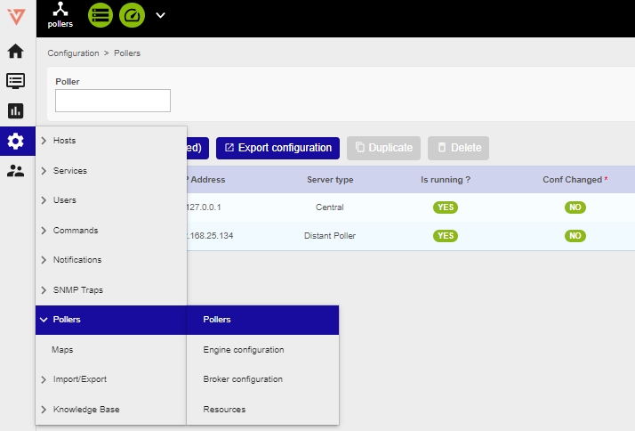

2. Click on Poller1 **Poller1**
3. Rename **Poller1** with a new name, according to your internal naming convention
4. Enter the IP address of the Smart Poller

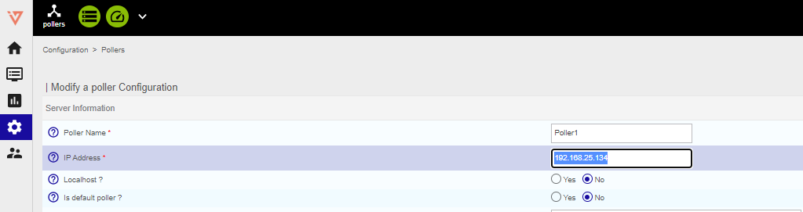

5. Save this configuration by clicking **Save** at the top right corner

---

## Broker configuration

1. go to Configuration -> Pollers -> Broker configuration

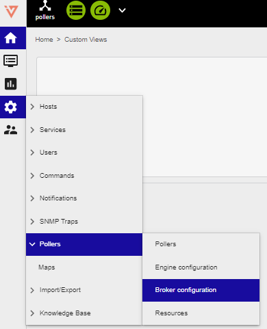

2. Click on Poller1 **Poller1**
3. In the **General** tab rename **Poller1** with a new name, according to your internal naming convention
4. Set the field **"Event queue max size"** to **250000**

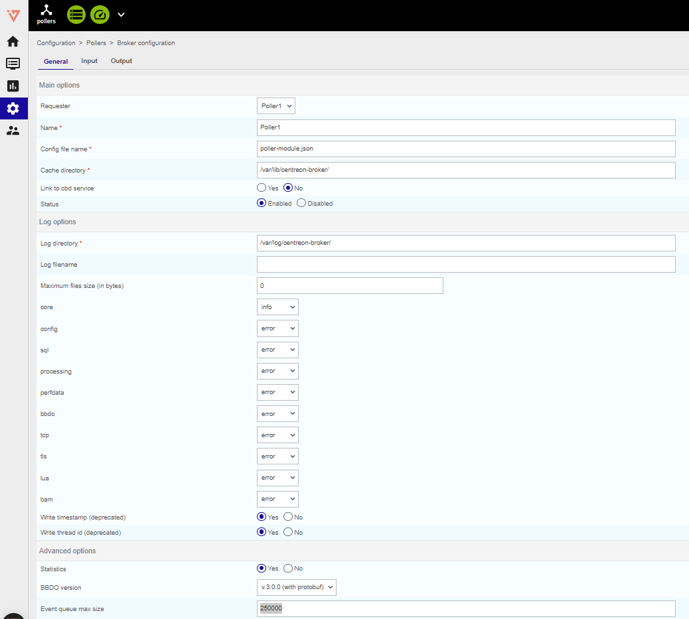

5. Select **Output** tab and enter the Central Manager IP **"Host to connect to"** filed

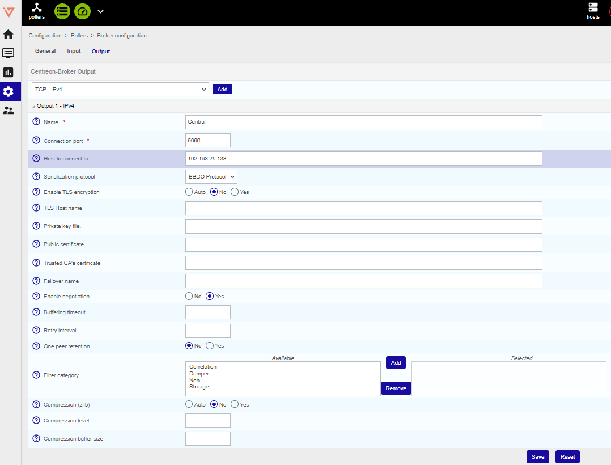

6. Save this configuration by clicking **Save** at the top right corner

---

## Engine configuration

1. go to Configuration -> Pollers -> Engine configuration

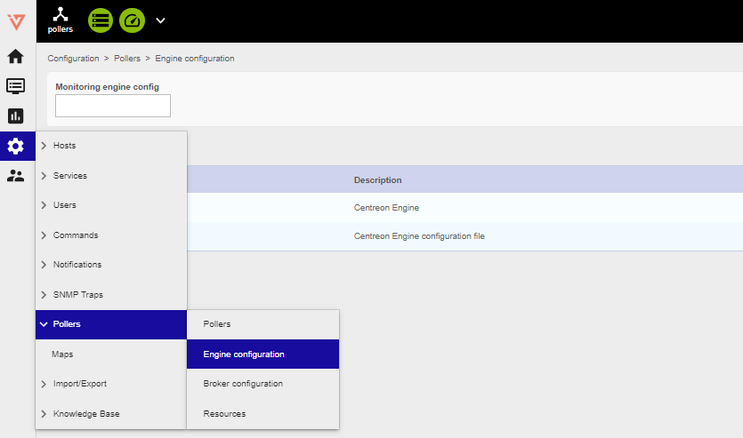

2. Click on Poller1 **Poller1**

3. In **Files** tab configuration Name: replace "Poller1" with a new poller name, as
per your naming convention

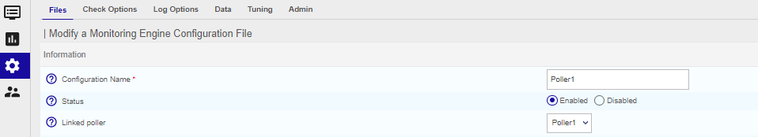

4. Go to **Data** tab and click on **+Add a new entry**

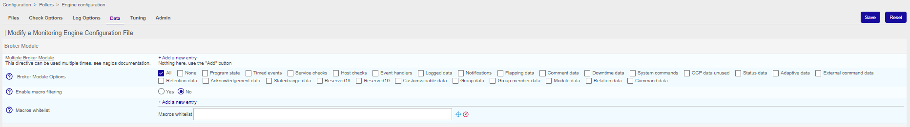

5. Enter these two brocker directive:

    1 - */usr/lib64/centreon-engine/externalcmd.so*

    2 - */usr/lib64/nagios/cbmod.so /etc/centreon-broker/poller-module.json*

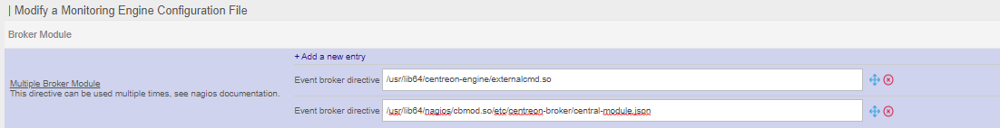

---

## Pollers restart

1. Go to Configuration -> Pollers -> Pollers

2. Select the Smart Poller that is being configured

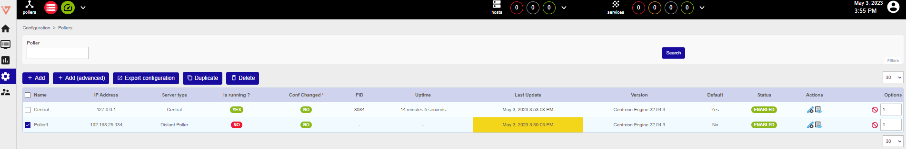

3. Click on **Export configuration**

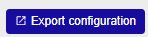

4. Select the first 4 options (at left) , then select **Method -> Restart** in the drop down menu

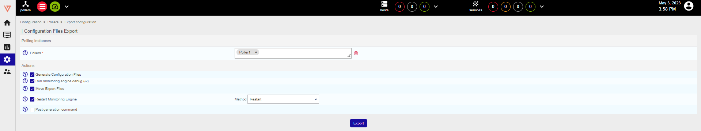

:::warning[Mandatory]

The following steps are mandatory

:::

5. Log on to the Central Management (SSH) do a sudo bash and enter the password
6. Launch the following commands:

    1 - *scripts*

    2 - *cd i-vertix/*

    3 - *./sync_poller.sh*
7. In case the system asks for a **yes/no** confirmation answer yes, the CLI will show as many "ok" as the number of Pollers that are being synchronized

:::info

Central Manager performs such a synchronization every 4 hours

:::

8. Final check, select: Configuration -> Pollers -> Pollers

Check the configuration is like the one shown
in the picture.

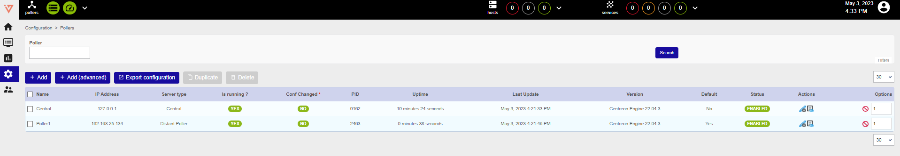