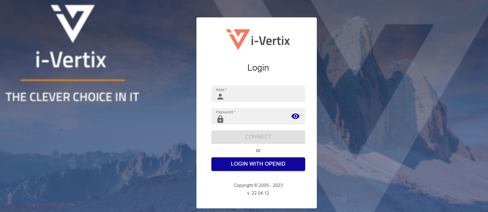
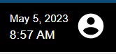
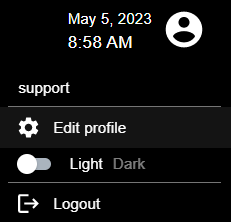
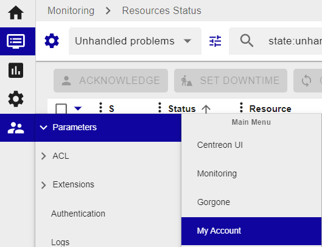
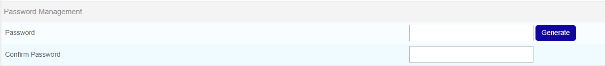
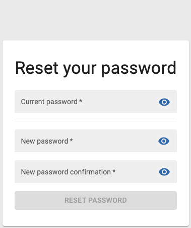

# First access to the web console

Once the license is activated, you can access the Central Manager web console.

Open your browser (see [Compatibility](../before-you-start/compatibility.md)) and enter the Central Manager IP Address previously configured (see [Network configuration](../Setup-Startup-Central-Poller/network-configuration.md)).

>Note: the Smart Poller does not have a web user interface.

You can log in using the default credentials:
1) Username: **admin**
2) Password: **password**

---

> Note: Please be advised that for security reason we recommend to change the **admin** password

## Change the web admin password

You can change your password by clicking on the user icon on
the top right corner

and then on Edit profile

or by selecting Administration -> Parameters -> My Account

Insert your new password or click on **Generate password** to
have the system create a random password for you.

## Reset your password when expired
If you have not changed your password before it expires, you will be redirected after login to a dedicated page where you can update it:

Fill in your current password, define a new one and then click on **Reset Password**.