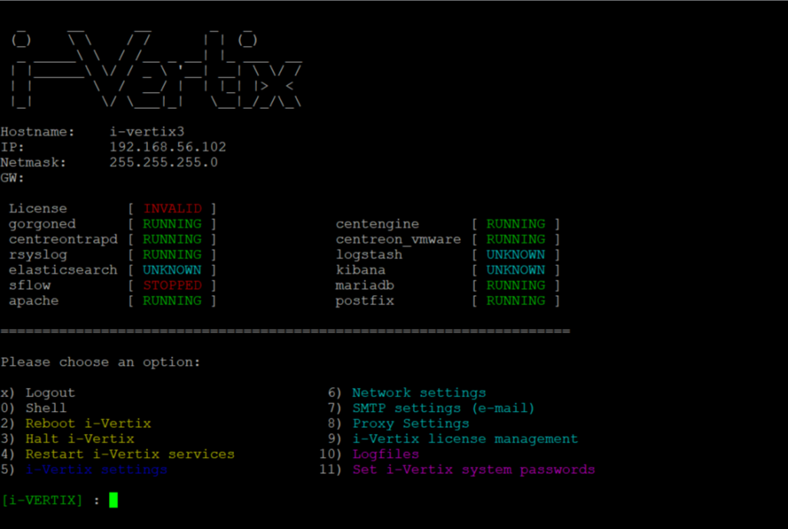

## First Login

After completing the VM configuration procedure in the chosen hypervisor, **start** the Central Manager and Smart Poller VMs.

The following configuration steps must be performed on both the Central Manager and the Smart Poller.
Startup can take from a few seconds to some minutes.

It is recommended that the startup process is checked through the **hypervisor console**.

Once the VM is started, the following screen with a login prompt will be displayed:


You will need to log into i-Vertix Monitoring console to configure the network settings, using the following credentials:

1) User: '**admin**'
2) Password: '**password**' (to be changed as soon as possible)

Note:
>After 3 failed logins, the IP Address will be blocked for 30
minutes (see [fail2ban](../Security-aspects/fail2ban.md)).

After the authentication, a menu that allows you to configure the next steps is displayed



> Note:
    > If the menu doesn’t appear automatically at startup, simply type on the console the command ```menu```.

The first task to be completed must be the [network configuration](network-configuration.md)

**NOTE:**
> Please be sure the [technical information](../before-you-start/technical-information.md) are done