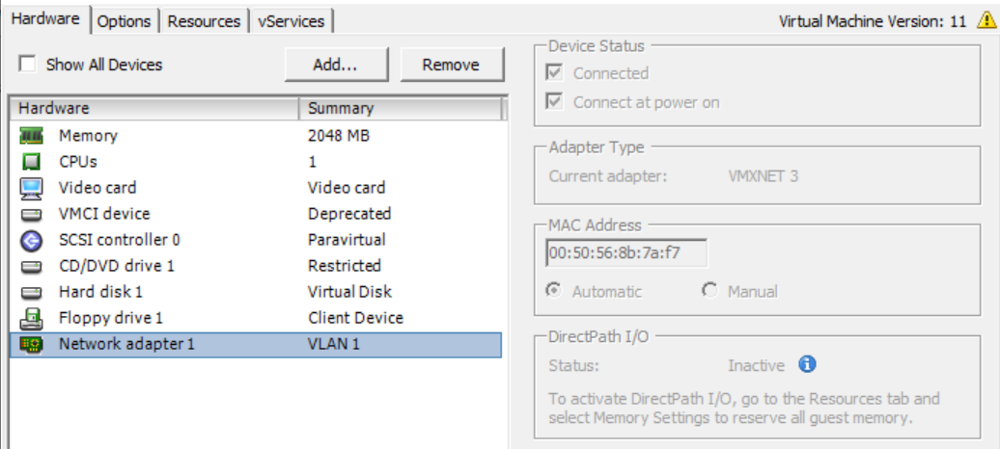

# i-Vertix OVAs (Central Management & Smart Poller)

**i-Vertix** support provides a ready-to-use virtual machine.
This virtual machine is available in **OVA** format for VMware environments.

It's based on the **Linux CentOS 7** (and all required packages) operating system and includes a i-Vertix installation that allows you to easily start your first monitoring.

**Server Requirements (VMs) for VMware**

The resources needed for optimal performance depend on the product configuration.

Adding more devices, monitors/services and other configuration options may increase the server and database workload.
Therefore, server configuration adjustments may be necessary to optimize performance for your specific environment.

**Database**

The database used is **MariaDB** (10.5.x) and is already included in the Central Manager System Image.

**Web browser to access the Central Manager web user interface**

i-Vertix Central Manager web interface is compatible with the following web browsers (see [Compatibility List](../before-you-start/compatibility.md)):

• Google Chrome (latest versions)

• Mozilla Firefox (latest versions)

• Apple Safari (latest versions)

• Microsoft Edge (latest versions)

Screen resolution should be at least 1280x768

**i-Vertix Central Manager Recommended characteristics**
- CPU: 4 vCPU (*)
- RAM: 8 GB
- HDD: 250 GB or greater (**)

:::note

(*) Exact number of required CPUs depends on frequency and type of monitors.

(**) Disk space required to store collected status and performance data depends on several factors, such as: polling interval, number and type of monitors and data retention period.

:::

**i-Vertix Smart Poller Recommended characteristics**

- CPU: 2 vCPU
- RAM: 8 GB (***)
- HDD: 60 GB

:::note

(***) Memory depends on frequency and type of monitors.

The VM uses the **Thin Provision** option to save as much free space as possible on the disk (this is best practice).

:::

# Steps to import a vm in VMware

## Downloading the virtual machine

1. Download the ".ova" files (as per email received); you can have an OVA for the Central Management, an On OVA for a poller or both.

2. Import the ".ova" files on your VMware infrastructure.

## Import the OVA in VMware
Log in to your vCenter or VMWare infrastructure and:
1. Right-click Host in the VMware Host Client inventory and select Create/Register VM. The New Virtual Machine wizard opens.
2. On the Select creation type page, select Deploy a virtual machine from an OVF or OVA file and click Next.
3. On the Select OVF and VMDK files page, provide a unique name for the virtual machine.
4. To select an OVF and VMDK, or an OVA file to deploy, click the blue panel. Your local system storage opens.
5. Select the file that you want to deploy your virtual machine from and click Open. The file you selected appears in the blue pane. Then click Next.
6. Click Next.
7. On the Select storage page, select the storage type for the virtual machine. Select a datastore from the list and click Next.
8. On the Deployment options page, select the network mappings, disk provisioning, and whether you want the virtual machine to power on after
deployment.
9. Click Next.
10. On the Ready to complete page, review the details and click Finish.

:::warning

Be sure to place the VM in the correct VLAN of your infrastructure.

:::

## Virtual Hardware configuration (Central Manager & Smart Poller)

Once the OVA has been imported into VMWare, Virtual Hardware (CPU and Memory) has to be configured.

1. Browse to the virtual machine in the vSphere Client.

2. Right-click and select **Edit Settings**.

3. Edit the **CPU** Resources (as requirements).

4. Edit the **Memory** Resources (as requirements).

5. Edit **Network** (according to your network ).

6. Click **OK**

Start the vm and wait for the login screen.

Now you can [login](first-login.md) via VMware console and configure the ip address.
