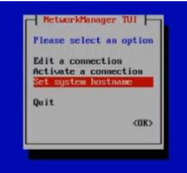

# Network configuration

:::caution

Before you start, plese be carefull to meet the technical requirement (see [Technical Information](../before-you-start/technical-information.md))

:::

To configure network settings:
1. Select option **6** Network settings>
2. Select option **1** Change network settings> (NTUI configuration manager starts up)
3. Select Edit Connection
4. Select the proper NIC (by default **ens192**) and then **Modify** followed by your network settings:
5. IPv4 Configuration: **Manual**
6. Addresses: IP address you want to assign to the Central Manager
7. Gateway: your default gateway IP address
8. DNS server: your DNS Server IP Address
9. Search domain: Insert the domain (if necessary)
10. IPv6 Configuration: **Ignore**

Confirm the settings with **OK**

---

Get back to main menu NMTUI (on the lefthand side)

To activate the new settings, select **Activate a connection** from the NMTUI menu

• Select the **NIC** (ens192 by default ), then

• **Deactivate**

• **Activate**

Finally select **Back**

---

Get back to the main NTUI menu

• Select **Set a system hostname** to configure the system hostname then select **OK**

• Select **Quit** to quit the **NMTUI** menu and get back to the **i-Vertix menu**

---

Now network configuration is complete (restart the vm if necessary) and the system is accessible via network connection (for example using **Putty**)

You can go to [First login](first-login.md)