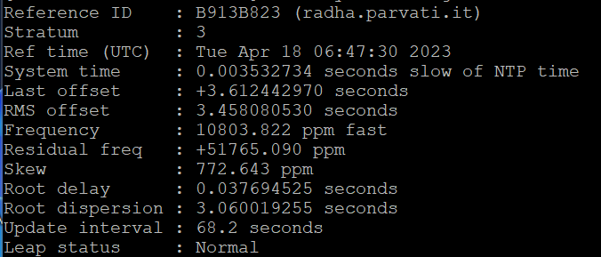
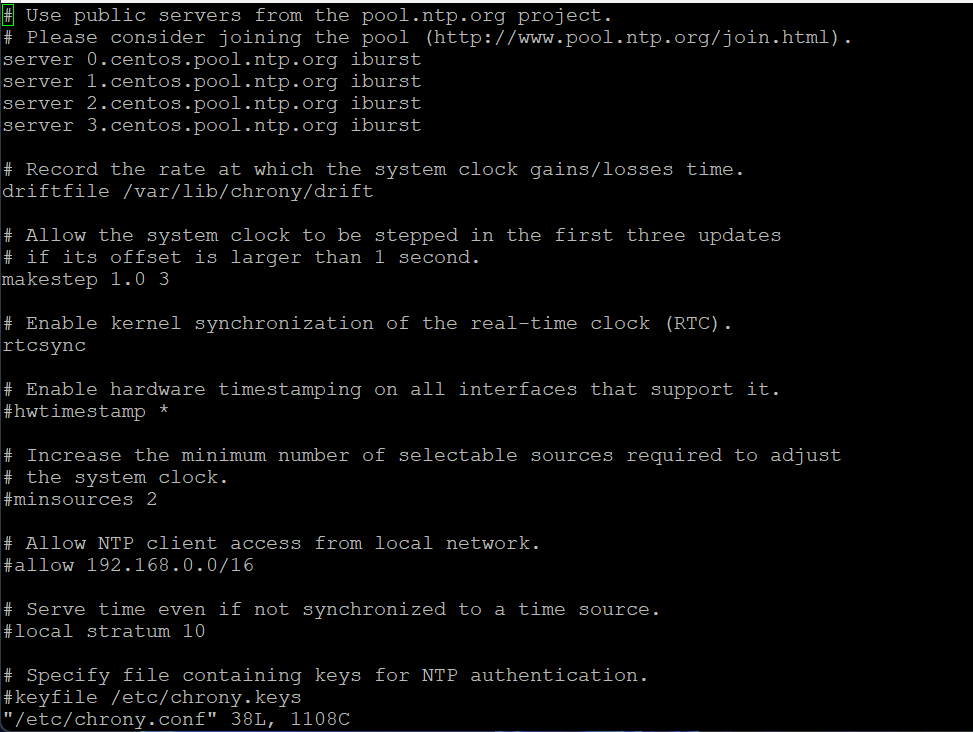

# Configuration of NTP (CLI)

In the system shell follow this procedure:

• Run the command *sudo bash* (root password is required)

• Launch the command *chronyc tracking* (to check synchronization, see ex. 1)

• Run the command *chronyc sources* (to che NTP source, see ex. 2)

---

## Modifying NTP settings

• Run the command *sudo bash* (root password is required)

• Run the command *vi /etc/chrony.conf* (see ex. 3)

• Comment (using the *#*) servers 0, 1, 2, 3 and insert the NTP Server address that fit your necessities (if
requested)

• Save the file

• Run the command systemctl *restart chronyd.service*

---
### Examples

Ex. 1

Ex. 2

Ex. 3
