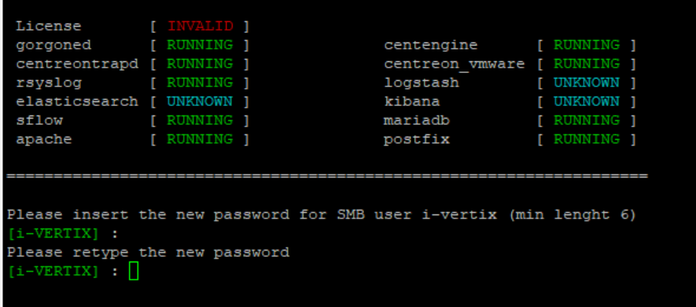

## Configuration of system password (CLI)

You would have to select a new **SSH/console password** for the **user admin**

**NOTE**

>Check that **DNS** is working

Type **ping www.google.com** and verify that the output returns Google IP Address, for example:

```
ping www.google.com
PING www.google.com (142.250.180.164) 56(84) bytes of data.
64 bytes from mil04s44-in-f4.1e100.net (142.250.180.164): icmp_seq=1 ttl=117 time=5.76 ms
64 bytes from mil04s44-in-f4.1e100.net (142.250.180.164): icmp_seq=2 ttl=117 time=6.11 ms
64 bytes from mil04s44-in-f4.1e100.net (142.250.180.164): icmp_seq=3 ttl=117 time=5.99 ms
64 bytes from mil04s44-in-f4.1e100.net (142.250.180.164): icmp_seq=4 ttl=117 time=5.87
```

**NOTE**

>Check that Internet access is available (http and https).

Type **cd /tmp** then **wget www.google.it**, type **ll** to make sure that the file **index.html** was created.

**NOTE**
>Internet connection should always be available, to perform (among other things):
>1) [License installation](license.md) (performed by i-Vertix personnel)
>2)  [Plugin Packs installation](plugin-pack-install.md) (performed by i-Vertix personnel)
>3)  [NTP configuration](ntp-configuration.md)


In order to **modify the password**:

1) Log into the system

2) Enter **menu** command


3) Select option **10) i-Vertix poller passwords** _(in case of Smart Poller)_

4) Select option **11) Set i-Vertix poller passwords** _(in case of Central Manager)_

5) Type the new password **_(min. 6 characters)_** for **SSH user admin**, twice _(for Central Manager & Smart Poller)_


6) Type the new password **_(min. 6 characters)_** for **SMB user i-vertix**, twice _(for Central Manager only)_



