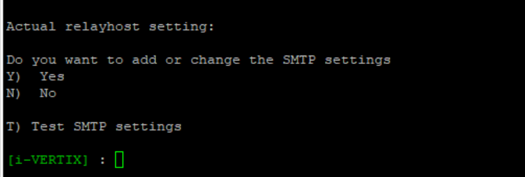
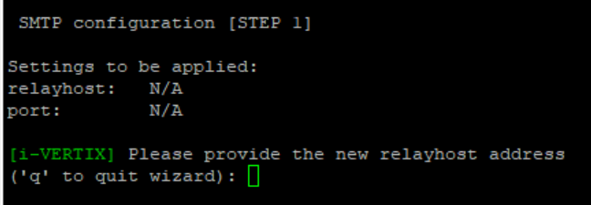
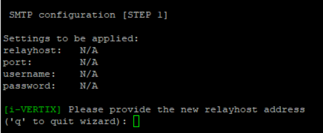
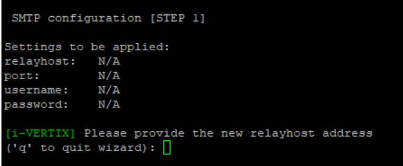

Email notifications settings can be configured on both Central Manager and Smart Poller.

**NOTE:**
> By default, notifications about to monitored devices/services are sent by Smart Pollers.

Since the Central Manager can perform self-diagnostics procedures, in case it detects any issues, it can generate alarm
notifications as well.

Therefore, SMTP should be configured also on the Central Manager itself.

## SMTP Configuration

1) Select option **7) SMTP settings (e-mail)**

2) A new menu shows up

3) Select **Y**
4) A new menu shows up

5) Select the proper SMTP option among the proposed ones

### Available options are

1) **Normal SMTP**: please follow each step carefully

2) **SMTP with authentication**

3) **SMTP for Office365 or Amazon AWS SES**

---

### Configuration steps for SMTP

Compile every voice the menu steps indicate for each SMTP option you choose.

Once the proper option has been selected and configured, quit using **q** command

If you want to test the configuration you've just made, simply type **T) Test SMTP settings** in the menu.

**NOTE:**
> Provide real a e-mail sender and a e-mail reciver for the test.
