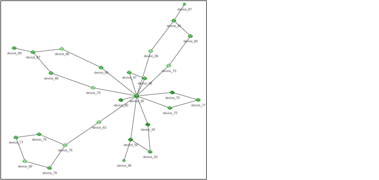
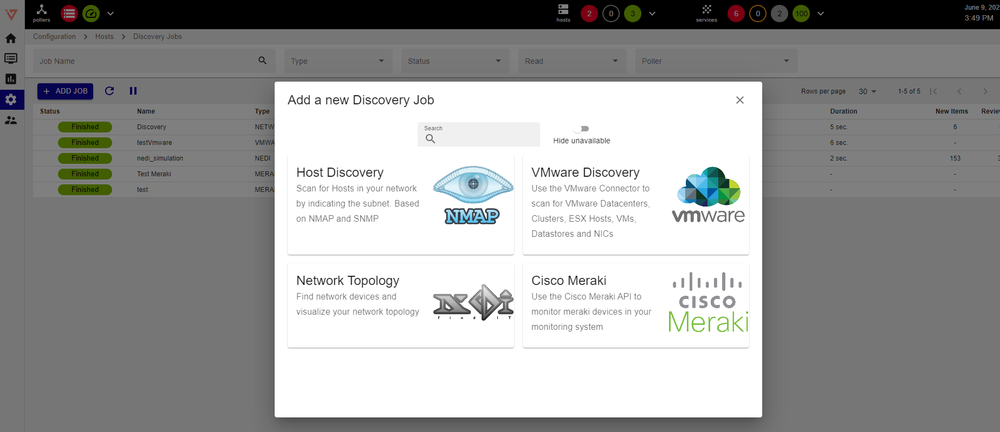
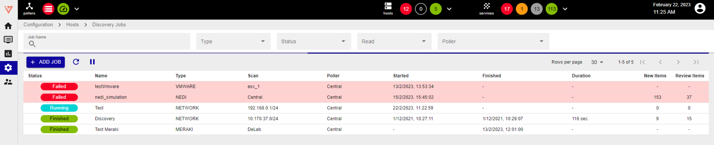

## Overview and fast onboarding

Different types of granular discoveries let the user easily filter/select services and hosts that are to be discovered and monitored.
* **Network Topology Discovery**: Layer 2/3 discovery that creates comprehensive network topology maps.

* **Host/Device Discovery**: scans any network, subnet, or IP address.

* **VMware Discovery**: scans VMware environment (Datacenter, Clusters, Hosts, Datastores, VMs, NICs).

* **Cisco Meraki**: discovers cloud Cisco Meraki infrastructures (APs and Switches)

Discovery results are matched with preconfigured monitoring templates to automate monitoring configuration.

## Quick start

### New Discovery Job

To add a new Discovery Job:

* go to **Configuration -> Hosts -> Discovery Jobs** 
* click on **+ADD JOB**
* select the desired discovery type:
    * **Host Discovery**
    * **Network Topology Discovery**
    * **VMware Discovery**
    * **Meraki Job Wizard**

**Note: it could be that Host Discovery, VMware Discovery and Cisco Meraki are grayed out**
* Host Discovery: download **Linux SNMP** plugin from Plugin Store and install it 
* VMware Discovery: download **VMware vCenter** and **vSAN** (optional) plugins from Plugin Store and install them 
* Cisco Meraki: download **Cisco Meraki Cloud Controller** plugin from Plugin Store and install it 

**Discovery Jobs** panel shows all the jobs that have been created.

Each job has the following attributes: status, name, type (VMWARE, NEDI, NETWORK, MERAKI), start time, end time, duration, new items and review items. 
Job status can be:
* **New**: new discovery job.
* **Running**: the job execution is in progress, and the job can’t be modified until it completes. 
* **Failed**: job didn’t complete correctly. To see the reason why it failed, hover the mouse over the **F** button. A failed job has to be fixed/modified before it can be re-launched. 
* **Finished**: the job completed successfully and its results can be viewed. 

The job can now be:

* Restarted
* Modified
* Duplicated
* Deleted

