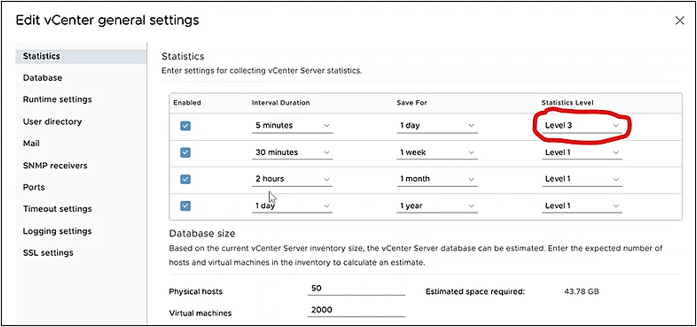
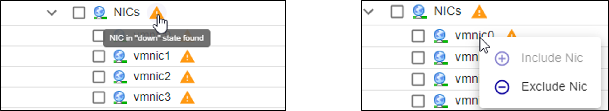

## Prerequisites

Before the scan, configure vCenter settings
* Create a read only user who can access vCenter and select the option Propagate to children

* Configure Statistic Level, increasing it from 1 to 3:
    * In the vSphere Client, navigate to the vCenter Server instance.
    * Select the Configure tab.
    * On the lefthand menu, click on Settings >  General
    * Click EDIT on the top right corner.
    * In the table, only for interval duration = 5 minutes, change Statistics level from 1 to 3

## Job settings 
### Main settings

* **Job Name**: use a meaningful name
* **Poller**: select the Smart Poller that will perform the scan
* **Container**: select a Container or click on **+ ADD CONTAINER** to create a new one (Container used to communicate with VMware):

### CONNECTION

* **Container Name**: use a meaningful name
* **Poller**: select the Poller that will issue the connection request
* **Protocol**: http or https
* **IP / FQDN**: enter the vCenter IP Address

### AUTHENTICATION

Credentials that are to be used to access the virtual environment (the read-only one previously configured)
Once CONNECTION and AUTHENTICATION are configured, click on **“SAVE & DEPLOY”**
* **ESX, Datastores, Virtual Machines, NICs**: select the ones you want to scan

### Access

Access Groups: users who can view and modify this job and all the hosts it will discover

### Excluded Object

List of items that have to be excluded from the scan

### Template Rules
Mapping rules are preconfigured by i-Vertix

**Note**: It can happen that some **Template Rules** are missing. In such a case:

* **Download the relevant plugin** from the Plugin Store and install it
* Click on **RESET** to add Template Rules included in the plugin you have just installed to the Template Rules list
* Contact support@i-vertix.com  if the template rule is still not available

Click on **NEXT** to run the scan. The user interface shows all the discovery steps, while they happen.

### Tree view
Once the scan finishes, the virtual environment topology/tree is displayed. 

To start monitoring any discovered items, select them and click on **ADD/UPDATE MONITORING**. 

Remember to **export the configuration to the Smart Pollers**.

**RESCAN**: click on it to perform a new scan.

**CHANGE PREFIX**: it can be used to add a prefix before the name of the selected items.

You can change Datacenter and/or Virtual Machines names. Once the you have edited it, the page will display both the hostname detected during the scan and the one you configured.  

To exclude an item from next discoveries and stop monitoring it, right click on it and then select **Exclude**. 

