First, configure a new **VMware discovery job**

[How to configure a new job](vmware-discovery.md)

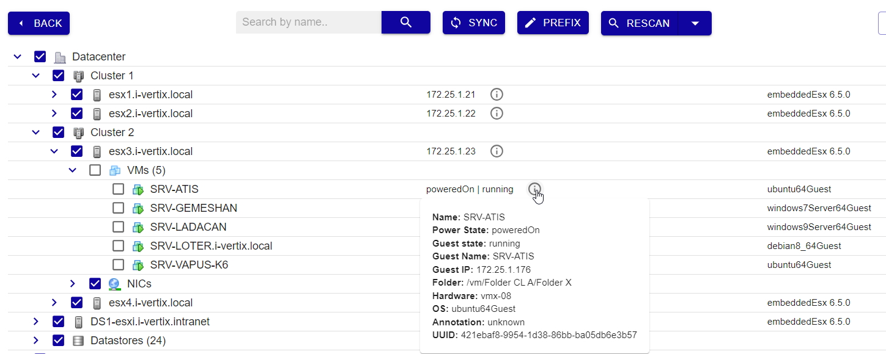

On the "Three View" page, in the top right-hand corner click on button: 

## OS Discovery

Clicking on it will display a view with a list of all discovered VMs. The view contains pre-applied filters in the "**PowerState**" and "**GuestState**" fields, which allow identifying powered on and running machines. The "**new**" and "**existing ip**" status filters identify new VMs waiting to be monitored and those with an already existing IP.

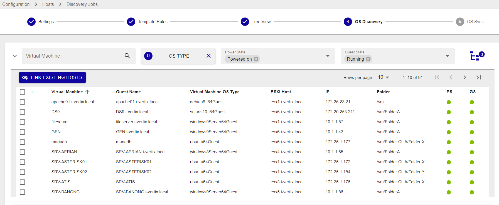

Different filters are available: **Virtual Machine, OS TYPE, Power State, Guest State, Folder, Dacenter, ESXI HOST IP and Status**.

**Power State** filters are:
* Powered on
* Powered off
* Suspended

**Guest State** filters are:
* Running
* Not running
* Shutting down
* Stand by
* Resetting
* Unknown

**Status** filters are:
* **new**: hosts are highlighted in green. SNMP connection was established and the proper templates were assigned to the hosts. To start monitoring new hosts, select them and click on **ADD TO MONITORING**.
* **existing (ip)**: an host with the **same IP address** had already been detected. The host is likely already being monitored.
* **existing**: an host with the **same IP address and hostname** had already been detected. The host is likely already being monitored.

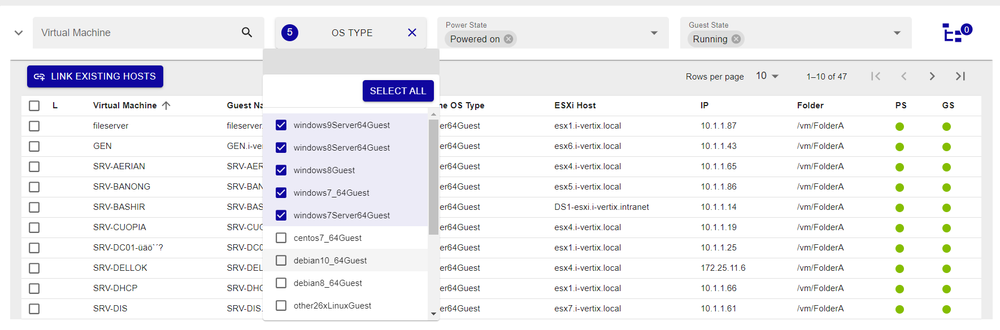 

### Templates and Credentials
**Configuration section**

* Select the **VMs**
* Assigned the related **template** to the selected VMs
    * Before using the discovery **Download the relevant plugin** from the Plugin Store and install it
    * Contact **support@i-vertix.com**  if the template rule is still not available
* Select or add new credentials (used for communications with the hosts)

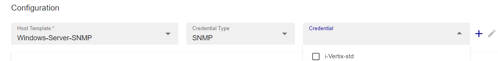 

* Select additional services or general connectivity check

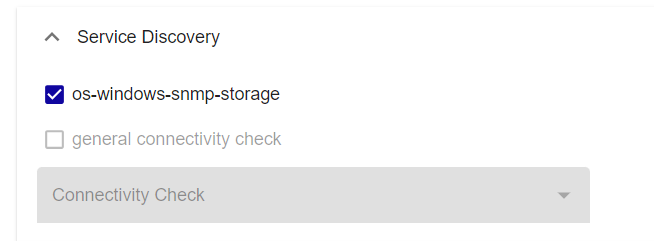 

### Relations and Hostgroups
**Host relation section**

* **Target Poller**: the hosts will be created on this poller
* **Access Groups**: the created hosts will be assigned to these Access Groups. Only users assigned to these groups can see or manage the created hosts
* **Hostgroups**: the created hosts will be added to the selected Hostgroups

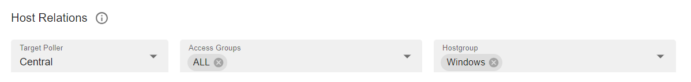 

* Press the **Next** button

**Note**
* The first time you run the discovery, there will be no credentials. They can be quickly created by clicking the "+" button, so they can be directly selected from the Credential field later on. Depending on the protocol/technology used, you will need to enter the correct information (version, community, certificate, username, password, etc.).

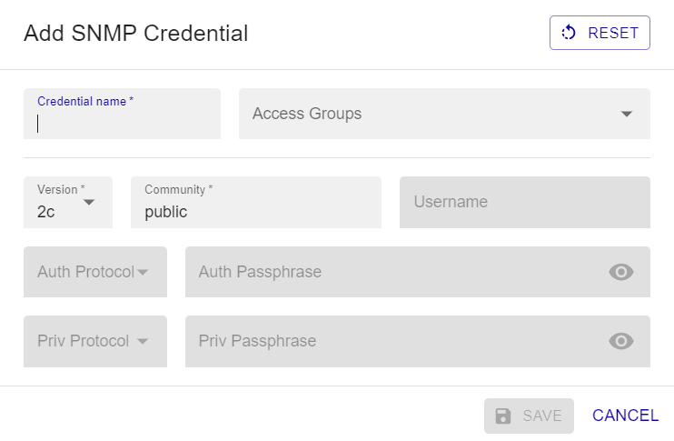 

* If you use for example the Windows SNMP template with community version 2c, all the servers you choose to monitor must have SNMP protocol enabled with the same community and version.
* It is also possible to automate the discovery of additional services. For example, in addition to the default monitored C: drive, you may want to add other existing disks.

### Monitoring and Connectivity Check
**OS SYNC section**

Once the configuration is complete, you move to the next section, OS Sync. In this new view, you have a list of the previously selected VMs that are in a "**New**" and "**Running**" state. These filters are already applied to show specific results. 

  

**OS SYNC** section displays the hosts that were detected by the discovery, along with the following information:

* **Hostname**
* **Virtual Machine**: VM name
* **IP**: VM IP Address
* **PS**: VM power state
* **GS**: VM guest state
* **Connectivity**:
    * X request failed         - ✓ request succeeded
* **Templates**: Template(s) assigned to the Host
* **Status**: Host status

Before synchronization, the function verify connectivity and check if the configured settings are functional. To add the VMs to monitoring, simply select the VMs and export the configuration to the Poller.

### Additional Information
**Scan results**

For each host, you can click on it and a popup windows shows information about the VMs and make it is possibile to apply changes to the hostname, alias and IP.

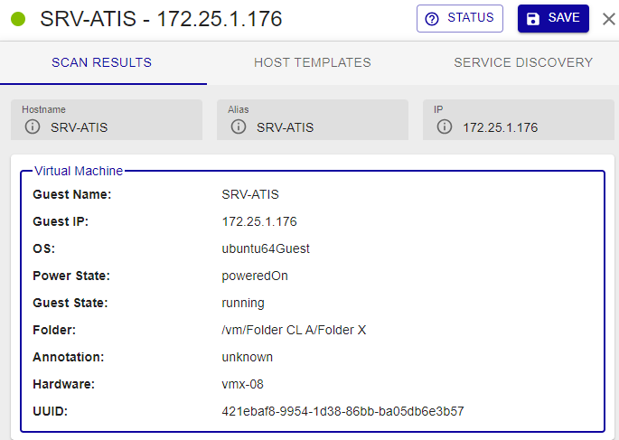

**Host templates** 

Host template associated with the host as per Template Rules match. To replace it or add another/others, click on **+ HOST TEMPLATE**

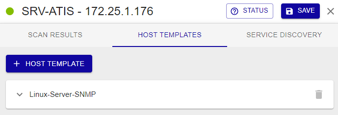

**Service discovery**

Template Rules are used to associate templates with hosts. They can also associate additional services, detected during the scan/discovery, with the Hosts. Manual changes are applicable.

:::note

SERVICE DISCOVERY tab is available if job discovery template rules are configured so that to detect additional services (in addition to the default ones). 

:::

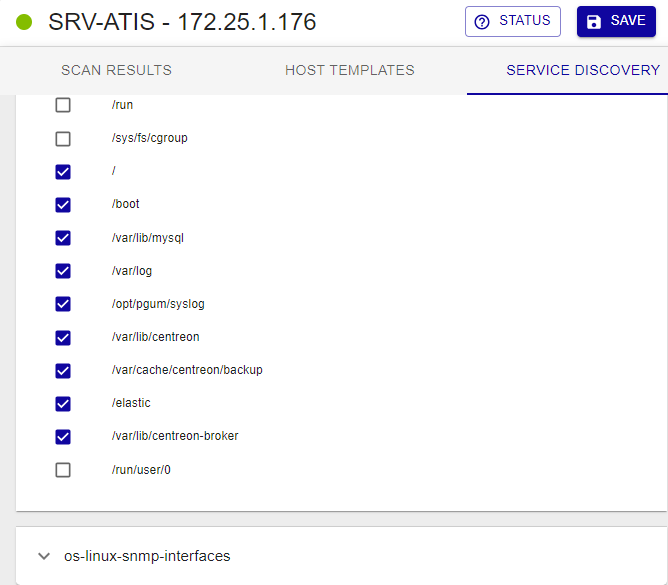

### Linked host

This functionality is also capable of recognizing any hosts that are already being monitored (**LINKED HOST**) and excludes them from the list of results.

It could happen that some hosts are already being monitored because they were previously added through other methods, and therefore they are displayed by the VMware discovery feature. The IP and hostname-based discovery compares which VMs have a match between the scanned hosts and the monitored ones. To resolve the conflict, following these instructions:

**Automatically link virtual machines**
* Select the VM with the link simbol
* Press the button **LINK EXISTING HOSTS**

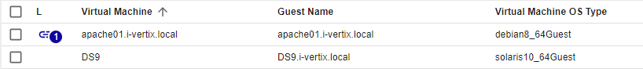

**Manually link virtual machines**
* Press on the link symbol in the VM 
* Select corresponding host and press the button LINK

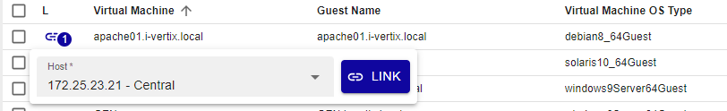